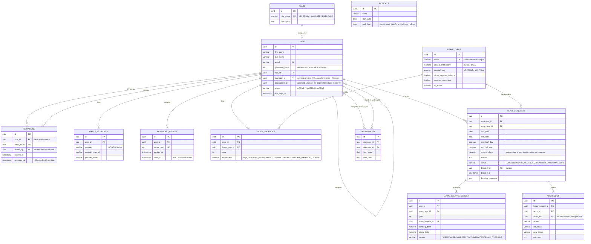

# 🗄️ Database Schema

> Source of truth: the numbered migration files in [`server/src/sql/`](../server/src/sql/). If this document and the SQL ever disagree, **the SQL wins** — fix this file to match it, not the other way round.

### Status Legend

| Emoji | Meaning |
|-------|---------|
| ✅ | **Live** — created by an applied migration, used by real code |
| ⬜ | **Planned** — from the original design, not built yet (see [1.functional_requirements.md](1.functional_requirements.md)) |

> 📅 Reflects the codebase as of migration `016_create_audit_logs.sql`.

---

## 📌 Keep this file in sync

> **Rule:** Whenever a new file is added to `server/src/sql/`, update this document in the same change — new/changed tables in the diagram and table breakdown below, and move anything from "🔮 Planned" to "✅ Live" once it's actually built. This is also logged in [`.claude/rules.md`](../.claude/rules.md) under Database Rules.

---

## 🧬 Entity-relationship diagram (live schema)

`HOLIDAYS` has no relationship to any other table — it's standalone reference data (see the note in its section below).

---

## 📋 Tables

### 🏷️ `roles`
*Migration: `002_create_roles.sql` + seed `003_seed_roles.sql`*

The three fixed roles the whole authorization system hinges on (`requireRole` middleware). Seeded once, never expected to change at runtime.

| Column | Type | Constraints | Description |
|---|---|---|---|
| `id` | `UUID` | PK, `gen_random_uuid()` | |
| `role_name` | `VARCHAR(30)` | `NOT NULL`, `UNIQUE` | One of `HR_ADMIN`, `MANAGER`, `EMPLOYEE` |
| `description` | `TEXT` | | Human-readable label |
| `created_at` | `TIMESTAMP` | default now | |

---

### 👤 `users`
*Migrations: `004_create_users.sql`, `005_alter_users_for_auth.sql`*

Every person in the system — HR admins, managers, and employees are all rows here, distinguished only by `role_id`. Managers are modeled as a self-referencing tree via `manager_id` (see `reportingService.js` for the cycle-prevention logic).

| Column | Type | Constraints | Description |
|---|---|---|---|
| `id` | `UUID` | PK | |
| `first_name` / `last_name` | `VARCHAR(50)` | `NOT NULL` | |
| `email` | `VARCHAR(255)` | `NOT NULL`, unique (case-insensitive via `uq_users_email_lower`) | Login identifier |
| `password_hash` | `TEXT` | nullable | bcrypt hash; `NULL` for an invited user who hasn't set a password yet |
| `role_id` | `UUID` | FK → `roles.id` | |
| `manager_id` | `UUID` | FK → `users.id` (`ON DELETE SET NULL`), `chk_manager_not_self` | 🌳 `NULL` only for the top-level HR admin |
| `department_id` | `UUID` | — | ⚠️ **Unused today** — column exists but no `departments` table or write path exists yet; always `NULL` |
| `status` | `VARCHAR(20)` | `CHECK IN ('ACTIVE','INVITED','INACTIVE')`, default `ACTIVE` | |
| `last_login_at` | `TIMESTAMP` | nullable | Set on every successful login |
| `created_at` / `updated_at` | `TIMESTAMP` | default now | |

**Indexes:** unique on `lower(email)`, plain index on `manager_id` (reporting-tree lookups).

---

### ✉️ `invitations`
*Migration: `006_create_invitations.sql`*

One row per invite sent to a new employee (see FR-001). The token itself is never stored in plain text — only its hash.

| Column | Type | Constraints | Description |
|---|---|---|---|
| `id` | `UUID` | PK | |
| `user_id` | `UUID` | FK → `users.id`, `ON DELETE CASCADE` | The account this invite activates |
| `token_hash` | `TEXT` | `NOT NULL`, `UNIQUE` | Hash of the token embedded in the invite link |
| `invited_by` | `UUID` | FK → `users.id` | The HR admin who sent it |
| `expires_at` | `TIMESTAMP` | `NOT NULL` | Invites expire after `INVITE_TOKEN_TTL_HOURS` (default 24h) |
| `accepted_at` | `TIMESTAMP` | nullable | `NULL` while still pending |
| `created_at` / `updated_at` | `TIMESTAMP` | default now | |

**Index:** partial unique index `uq_invitations_active_user` on `user_id` **where `accepted_at IS NULL`** — guarantees at most one *pending* invite per user without blocking re-inviting after expiry/acceptance.

---

### 🔗 `oauth_accounts`
*Migration: `007_create_oauth_accounts.sql`*

Links a `users` row to an external identity provider (FR-003 social login). One user can have at most one linked account per provider.

| Column | Type | Constraints | Description |
|---|---|---|---|
| `id` | `UUID` | PK | |
| `user_id` | `UUID` | FK → `users.id`, `ON DELETE CASCADE` | |
| `provider` | `VARCHAR(20)` | `CHECK IN ('GOOGLE')` | More providers = extend the check constraint |
| `provider_user_id` | `VARCHAR(255)` | `NOT NULL` | The provider's own subject/user id |
| `provider_email` | `VARCHAR(255)` | `NOT NULL` | Email as reported by the provider at link time |
| `linked_at` | `TIMESTAMP` | default now | |
| `created_at` / `updated_at` | `TIMESTAMP` | default now | |

**Uniqueness:** `(provider, provider_user_id)` — one provider identity can't link to two accounts; `(user_id, provider)` — one account can't link the same provider twice.

---

### 🔑 `password_resets`
*Migration: `008_create_password_resets.sql`*

Same shape as `invitations`, for the "forgot password" flow — a hashed, expiring, single-use token.

| Column | Type | Constraints | Description |
|---|---|---|---|
| `id` | `UUID` | PK | |
| `user_id` | `UUID` | FK → `users.id`, `ON DELETE CASCADE` | |
| `token_hash` | `TEXT` | `NOT NULL`, `UNIQUE` | |
| `expires_at` | `TIMESTAMP` | `NOT NULL` | |
| `used_at` | `TIMESTAMP` | nullable | `NULL` while still usable |
| `created_at` / `updated_at` | `TIMESTAMP` | default now | |

**Index:** partial unique index `uq_password_resets_active_user` on `user_id` **where `used_at IS NULL`** — at most one live reset request per user.

---

### 🌴 `leave_types`
*Migration: `009_create_leave_types.sql`*

HR-managed catalog of leave categories (Annual, Sick, Casual, …) — see FR-007.

| Column | Type | Constraints | Description |
|---|---|---|---|
| `id` | `UUID` | PK | |
| `name` | `VARCHAR(100)` | `NOT NULL`, unique (case-insensitive via `uq_leave_types_name_lower`) | |
| `annual_entitlement` | `NUMERIC(5,1)` | `NOT NULL`, `CHECK >= 0` | Must be a multiple of 0.5 (validated in `leaveTypeValidator.js`, not the DB) — supports half-day entitlements |
| `accrual_type` | `VARCHAR(20)` | `CHECK IN ('UPFRONT','MONTHLY')` | `MONTHLY` is metadata only today — no accrual scheduler runs yet |
| `allow_negative_balance` | `BOOLEAN` | default `false` | |
| `requires_document` | `BOOLEAN` | default `false` | Supporting-document requirement, enforced once leave requests exist (FR-012) |
| `is_active` | `BOOLEAN` | default `true` | Deactivated types are hidden from new selections but kept for history |
| `created_at` / `updated_at` | `TIMESTAMP` | default now | |

---

### 📊 `leave_balances`
*Migrations: `010_create_leave_balances.sql`, `014_create_leave_balance_ledger.sql`*

Per-employee, per-leave-type, per-year balance (FR-008). Rows are created lazily — the service ensures one exists for every active leave type the first time a user's balances are read, rather than via a rollover job.

| Column | Type | Constraints | Description |
|---|---|---|---|
| `id` | `UUID` | PK | |
| `user_id` | `UUID` | FK → `users.id`, `ON DELETE CASCADE` | |
| `leave_type_id` | `UUID` | FK → `leave_types.id`, `ON DELETE RESTRICT` | Can't delete a leave type that still has balance rows |
| `year` | `INTEGER` | `NOT NULL` | Calendar year the balance applies to |
| `entitlement` | `NUMERIC(5,1)` | default `0` | Snapshot of `leave_types.annual_entitlement` at creation time |
| `created_at` / `updated_at` | `TIMESTAMP` | default now | |

**Uniqueness:** `(user_id, leave_type_id, year)` — exactly one balance row per person/type/year. **Index:** `user_id` (dashboard lookups).

> ⚠️ **`days_taken`/`days_pending` are not columns here** — migration 014 dropped them. They're computed at read time by summing `leave_balance_ledger` (see below) — this is what makes NFR-2 ("a balance must never drift") a structural guarantee: there's no running total that could ever fall out of step with the history that produced it.

---

### 🎉 `holidays`
*Migrations: `011_create_holidays.sql`, `012_add_holiday_date_range.sql`*

Company-wide public holidays (FR-010) — visible to everyone, editable by HR only. Originally a single `holiday_date`; migration 012 turned it into a **date range** so multi-day holidays (e.g. a 5-day Diwali) are one row instead of five.

| Column | Type | Constraints | Description |
|---|---|---|---|
| `id` | `UUID` | PK | |
| `name` | `VARCHAR(150)` | `NOT NULL` | |
| `start_date` | `DATE` | `NOT NULL` | Renamed from `holiday_date` in migration 012 |
| `end_date` | `DATE` | `NOT NULL`, `CHECK (end_date >= start_date)` | Equals `start_date` for a single-day holiday |
| `created_at` / `updated_at` | `TIMESTAMP` | default now | |

**No uniqueness constraint on dates** — overlapping ranges are rejected at the *application* layer (`holidayService.js` → `findOverlappingHoliday`, returns `409`), not the database, since a DB-level exclusion constraint would need the `btree_gist` extension for little extra benefit here. Not linked to `users` — unlike the original design sketch (below), there's no `created_by` column; nothing currently needs to know who added a holiday.

---

### 📝 `leave_requests`
*Migration: `013_create_leave_requests.sql`*

Module 3's core table — an employee's leave request and its lifecycle (FR-011, FR-016). See the state machine in `server/src/services/leaveRequestStateMachine.js` for the legal status transitions.

| Column | Type | Constraints | Description |
|---|---|---|---|
| `id` | `UUID` | PK | |
| `employee_id` | `UUID` | FK → `users.id`, `ON DELETE CASCADE` | |
| `leave_type_id` | `UUID` | FK → `leave_types.id`, `ON DELETE RESTRICT` | |
| `start_date` / `end_date` | `DATE` | `NOT NULL`, `CHECK (end_date >= start_date)` | |
| `start_half_day` / `end_half_day` | `BOOLEAN` | default `false` | |
| `working_days` | `NUMERIC(5,1)` | `NOT NULL`, `CHECK > 0` | **Snapshotted at submission** — never recomputed, so editing the holiday calendar later can't retroactively change an already-decided request's day count or the balance history it produced |
| `reason` | `TEXT` | `NOT NULL` | |
| `status` | `VARCHAR(20)` | `CHECK IN ('SUBMITTED','APPROVED','REJECTED','WITHDRAWN','CANCELLED')`, default `SUBMITTED` | |
| `decided_by` | `UUID` | FK → `users.id`, nullable | Whoever most recently changed the status — approver, the employee themself (withdraw/cancel), or HR (override) |
| `decided_at` | `TIMESTAMP` | nullable | |
| `decision_comment` | `TEXT` | nullable | |
| `created_at` / `updated_at` | `TIMESTAMP` | default now | |

**Indexes:** `employee_id`, and `(employee_id, status)` (overlap checks and "my requests" both filter this way).

---

### 📒 `leave_balance_ledger`
*Migration: `014_create_leave_balance_ledger.sql`*

Append-only entries explaining every change to a balance (NFR-2) — see the note on `leave_balances` above. Every leave-request action (submit/approve/reject/withdraw/cancel/override) writes exactly one row here; nothing ever updates or deletes one.

| Column | Type | Constraints | Description |
|---|---|---|---|
| `id` | `UUID` | PK | |
| `user_id` | `UUID` | FK → `users.id`, `ON DELETE CASCADE` | |
| `leave_type_id` | `UUID` | FK → `leave_types.id`, `ON DELETE RESTRICT` | |
| `year` | `INTEGER` | `NOT NULL` | A request spanning a year boundary is debited against its **start date's** year (documented simplification) |
| `leave_request_id` | `UUID` | FK → `leave_requests.id`, `ON DELETE CASCADE`, nullable | |
| `pending_delta` / `taken_delta` | `NUMERIC(5,1)` | default `0` | Signed amounts; a balance's `days_taken`/`days_pending` are `SUM()` over these per user/type/year |
| `reason` | `VARCHAR(30)` | `CHECK IN ('SUBMIT','APPROVE','REJECT','WITHDRAW','CANCEL','HR_OVERRIDE_APPROVE','HR_OVERRIDE_REJECT')` | Descriptive only — not read by any query logic |
| `created_at` | `TIMESTAMP` | default now | |

**Index:** `(user_id, leave_type_id, year)` (the exact grouping the balance SELECT sums over).

---

### 🔁 `delegations`
*Migration: `015_create_delegations.sql`*

A manager nominating someone to approve on their behalf for a date range (FR-020).

| Column | Type | Constraints | Description |
|---|---|---|---|
| `id` | `UUID` | PK | |
| `manager_id` | `UUID` | FK → `users.id`, `ON DELETE CASCADE` | |
| `delegate_id` | `UUID` | FK → `users.id`, `ON DELETE CASCADE`, `chk_delegations_not_self` | Any active user the manager can currently see via `GET /users` — not restricted to another manager |
| `start_date` / `end_date` | `DATE` | `NOT NULL`, `CHECK (end_date >= start_date)` | |
| `created_at` | `TIMESTAMP` | default now | |

**No DB-level overlap constraint** — two delegations for the same manager with intersecting ranges are rejected at the service layer (`delegationService.js`, `409`), same interval-overlap pattern as holidays.

---

### 🧾 `audit_logs`
*Migration: `016_create_audit_logs.sql`*

A full, append-only trail of every leave-request state change (FR-021).

| Column | Type | Constraints | Description |
|---|---|---|---|
| `id` | `UUID` | PK | |
| `leave_request_id` | `UUID` | FK → `leave_requests.id`, `ON DELETE CASCADE` | |
| `actor_id` | `UUID` | FK → `users.id` | Who actually performed the action |
| `acted_for` | `UUID` | FK → `users.id`, nullable | Set only when a delegate acts — the manager they were standing in for. `NULL` for every other actor |
| `action` | `VARCHAR(30)` | `NOT NULL` | e.g. `SUBMIT`, `APPROVE`, `HR_OVERRIDE_TO_APPROVED` |
| `old_status` / `new_status` | `VARCHAR(20)` | nullable | `old_status` is `NULL` for the initial `SUBMIT` entry |
| `comment` | `TEXT` | nullable | |
| `created_at` | `TIMESTAMP` | default now | |

**Append-only by convention, not by DB grant** — `auditLogRepository.js` exposes only an insert function, never update/delete, so no code path in this codebase can edit a past entry. **Index:** `leave_request_id`.

---

## 🔮 Planned tables (not yet implemented)

These come from the original schema design (`leave_management_system.db.sql`) and the remaining not-yet-built part of the roadmap. They're recorded here as a **starting sketch**, not a finalized design.

| Table | Backs | Purpose |
|---|---|---|
| ⬜ `leave_request_documents` | FR-012 | Supporting-document uploads attached to a request — **deferred pending a decision on storage** (Postgres `bytea` vs. object storage vs. a Render persistent disk) |

**Dropped from the original sketch** (superseded by what was actually built, or invalid):
- `invitation_tokens` / `password_reset_tokens` → replaced by `invitations` / `password_resets` above (same idea, different shape — token *hash* instead of raw token, `invited_by` added).
- `users.employee_code` → not carried over; nothing currently needs a separate employee code beyond `id`/`email`.
- `users_users` table and the `audit_logs.old_status → audit_logs.id` foreign key → these were artifacts of the diagramming tool that generated the original file (a junction table keyed on `password_hash`, and a status column pointing at a row id), not real relationships. Omitted here as errors, not a design decision to revisit.

---

## 🧠 Design conventions used throughout

- Every table's primary key is `UUID DEFAULT gen_random_uuid()` (`pgcrypto`, enabled in `001_enable_pgcrypto.sql`).
- Every table has `created_at`; most also have `updated_at` (see [`.claude/rules.md`](../.claude/rules.md) → Database Rules).
- "Soft" uniqueness (e.g. "only one *pending* invite per user") is modeled with a **partial unique index** (`WHERE accepted_at IS NULL`) rather than an application-only check — the database enforces it even under concurrent requests.
- Case-insensitive uniqueness (email, leave type name) uses a unique index on `lower(column)`, since Postgres `UNIQUE` is case-sensitive by default.
- Business-rule enums (`status`, `provider`, `accrual_type`) use a `VARCHAR` + `CHECK IN (...)` rather than a Postgres `ENUM` type, so adding a new value is a plain migration instead of an `ALTER TYPE`.
