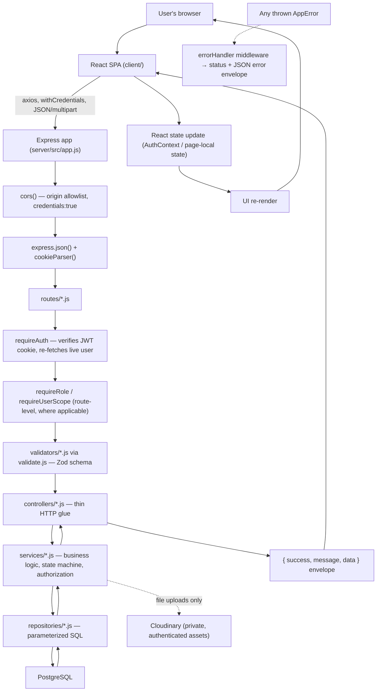
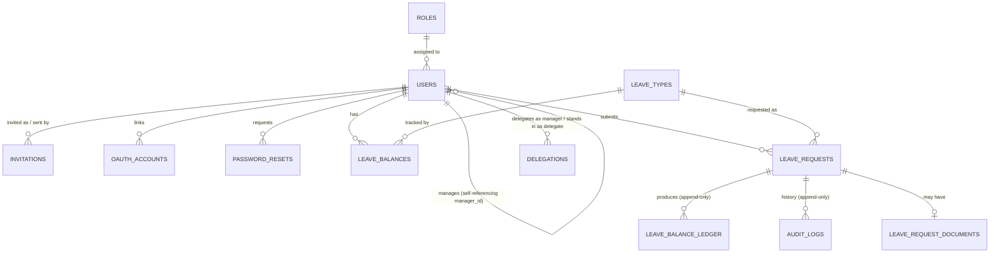
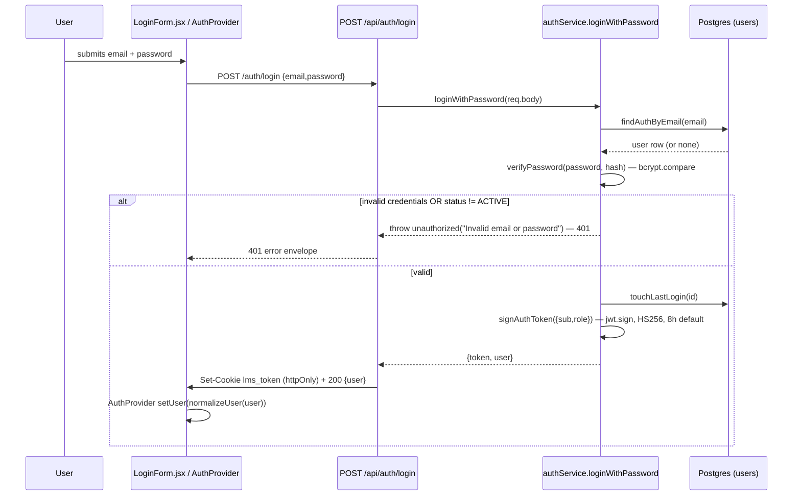
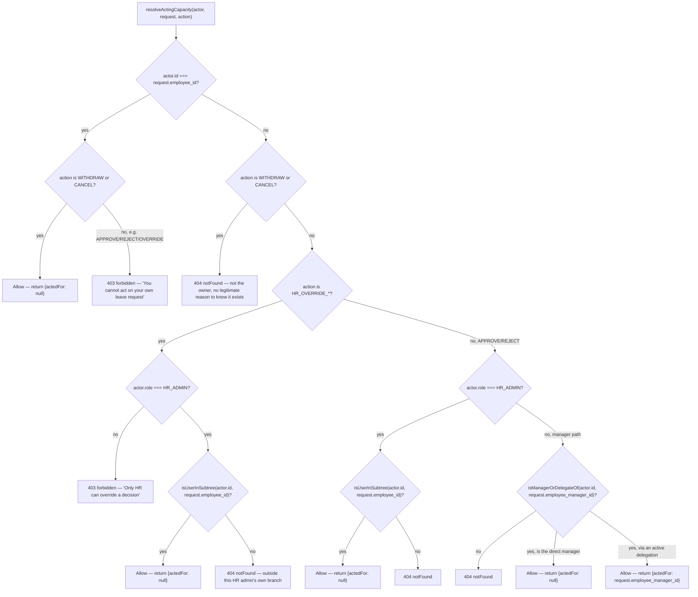
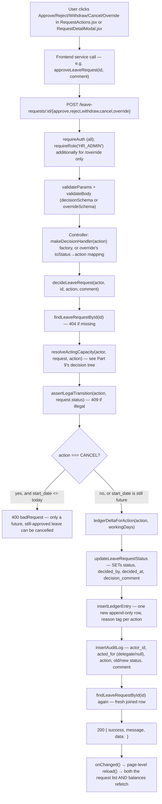

# Architecture & Workflow Reference

> **Purpose of this document**: a single place to re-learn this codebase months later without re-reading every file — how it's built, how every workflow actually executes end-to-end, what's tested, what isn't, and how to defend every design decision in an interview.
>
> **Source of truth ranking**: if this document ever disagrees with the code, the code wins. If it disagrees with `docs/1.functional_requirements.md`, `docs/2.api_documentation.md`, `docs/3.db.md`, `docs/4.non_functional_requirements.md`, or `.claude/rules.md`, treat those four as the authoritative spec-level docs and this file as the code-level companion to them — this file adds *how it's implemented*, not a competing description of *what it should do*.
>
> Everything below was verified directly against the source at `C:\Users\Prime\leave_management_system` (server in `server/`, frontend in `client/`). Anything not confirmed in the code is explicitly marked **"Not found in the current codebase."**

---

## Part 1 — Project Overview

**Project name**: Leave Management System (working title in the original brief: "Timeoff").

**Problem it solves**: replaces the "leave requested over email, tracked in a spreadsheet" pattern common in small companies — nobody knows their real balance, two people on a team can double-book the same week, and when someone leaves the company the history of what they took goes with them. This app centralizes requests, approvals, balances, and a full audit trail in one place with server-enforced authorization on every action.

**Who uses it and what they can do**:

```text
EMPLOYEE
    ↓
Submits a leave request (type, dates, half-day flags, reason, optional document)
Views own balance, own request history, own calendar
Withdraws a still-pending request; cancels an approved future request

MANAGER (is also an EMPLOYEE — role is additive)
    ↓
Everything an EMPLOYEE can do, plus:
Views and approves/rejects requests from their DIRECT reports only
Sees a team calendar
Nominates a delegate to cover approvals while away

HR_ADMIN (is also an EMPLOYEE — role is additive)
    ↓
Everything above, plus:
Invites new employees/managers/HR admins and manages the reporting tree
Defines leave types and manages the holiday calendar
Can act on any request in their OWN reporting subtree (not company-wide —
this app supports more than one HR_ADMIN, each the root of a separate branch)
Overrides a manager's decision (recorded distinctly as an override)
Browses/filters every request and generates a CSV leave-taken report
```

Everyone is fundamentally one `users` row distinguished only by `role_id` — `MANAGER`/`HR_ADMIN` are not separate account types, they're the same account with more permissions and (for `HR_ADMIN`) a wider view.

---

## Part 2 — Technology Stack

| Layer | Technology | Where used | Purpose |
|---|---|---|---|
| Frontend | React 18 (Vite) | `client/src/**` | Single-page app UI |
| Frontend routing | `react-router-dom` v6 | `client/src/App.jsx` | Route tree + guards |
| Frontend HTTP | Axios | `client/src/services/apiClient.js` | Talks to the backend API |
| Frontend OAuth (Google) | `@react-oauth/google` | `client/src/components/auth/GoogleLoginButton.jsx` | Renders Google's Identity Services button, returns an ID token |
| Frontend calendar UI | `@fullcalendar/*` | `client/src/components/calendar/*`, `leave/*Calendar.jsx` | Month-grid calendar rendering |
| Frontend icons | `lucide-react` | throughout `client/src/components` | Icon set |
| Frontend styling | Tailwind CSS | throughout | Utility-class styling, no CSS-in-JS |
| Backend runtime | Node.js (ES Modules) | `server/src/**` | — |
| Backend framework | Express.js | `server/src/app.js`, `routes/*.js` | HTTP routing/middleware |
| Database | PostgreSQL | `server/src/sql/*.sql`, `config/db.js` | Persistence |
| DB access | Raw parameterized SQL via `pg` (**no ORM**) | `server/src/repositories/*.js` | Every query is hand-written SQL — confirmed no Prisma/Sequelize/TypeORM anywhere in `package.json` or the codebase |
| Validation | Zod | `server/src/validators/*.js` | Request-shape + business-rule schema validation before every controller runs |
| Auth — password | bcrypt | `server/src/utils/password.js` | Password hashing (10 salt rounds) |
| Auth — session | `jsonwebtoken`, stored in an `httpOnly` cookie | `server/src/utils/jwt.js`, `cookies.js` | Stateless session; no server-side session store |
| Auth — Google OAuth | `google-auth-library` | `server/src/config/googleClient.js` | Verifies a Google-issued ID token |
| File storage | Cloudinary (`type: authenticated`, private assets) | `server/src/services/cloudinaryService.js`, `config/cloudinary.js` | Leave-request supporting documents — Postgres stores only a reference (`cloudinary_public_id`), never the file bytes or a public URL |
| File upload handling | `multer` (memory storage) | `server/src/middlewares/uploadMiddleware.js` | Buffers the upload in memory (never touches disk) before Cloudinary upload |
| Testing — backend | Vitest + Supertest | `server/src/tests/**` | Integration tests hit a real `_test` Postgres DB through the actual Express app; one unit-test file has no DB |
| Testing — frontend | Vitest + React Testing Library + `@testing-library/user-event` | `client/src/**/*.test.jsx` | Component tests |
| Deployment | Render (two separate services) | `.claude/rules.md` → Deployment section | Frontend = Static Site, backend = Web Service, different `*.onrender.com` subdomains (cross-site, not just cross-origin) |

**Not used, despite being common in this space**: no ORM, no Redis, no Docker (not found in the codebase), no message queue, no dedicated logging/APM library (just `console.*`), no rate-limiting library, no maintained date library (`date-fns`/`dayjs`/`moment`/`luxon` — all hand-rolled in `server/src/utils/dates.js` and mirrored in `client/src/utils/dates.js`, deliberately avoiding `Date`/`toISOString()` UTC-shift bugs).

---

## Part 3 — Folder Structure & File Responsibility Map

```text
leave_management_system/
├── client/                        React (Vite) frontend
│   └── src/
│       ├── pages/                 One file per route's top-level page
│       ├── components/
│       │   ├── auth/              Login form, Google button, RoleGate
│       │   ├── routing/           RequireAuth, RequireRole, PublicOnlyRoute
│       │   ├── layout/            Sidebar, TopBar, AppLayout, NavBar
│       │   ├── ui/                Generic primitives (Button, Modal, Card, Badge, …)
│       │   ├── leave/             Leave-request/approval/delegation components
│       │   ├── team/              Employee invite/org-chart components
│       │   ├── calendar/          Holiday calendar components
│       │   └── dashboard/         Dashboard summary tiles
│       ├── context/               AuthContext + AuthProvider
│       ├── hooks/                 useAuth, useActiveDelegation, useClickOutside, usePendingApprovalsCount
│       ├── services/               One file per backend resource — the only place `apiClient` is called from feature code
│       ├── utils/                 dates.js, validation.js, employeeGroups.js
│       ├── constants/             roles.js, badges.js, leaveBalanceAccents.js
│       └── tests/                 Shared test fixtures/setup
│
├── server/                        Node/Express backend
│   └── src/
│       ├── app.js, server.js      Express app wiring / process entrypoint
│       ├── routes/                 Express routers — endpoints only
│       ├── middlewares/            requireAuth, requireRole, requireUserScope, errorHandler, uploadMiddleware, validate
│       ├── controllers/            Thin HTTP glue — read req, call a service, send a response
│       ├── services/                Business logic only
│       ├── repositories/            Raw parameterized SQL only, one file per table (roughly)
│       ├── validators/             Zod schemas, one file per resource
│       ├── utils/                  appError, apiResponse, cookies, jwt, password, csv, fileType, dates, secureToken
│       ├── config/                 db.js (pg Pool), googleClient.js, cloudinary.js
│       ├── sql/                    001…018, numbered sequential migrations, never edited after being applied
│       ├── scripts/runMigrations.js  Applies every file in sql/ in filename order
│       └── tests/
│           ├── unit/                No DB (workingDayService.test.js)
│           └── integration/         Real `_test` Postgres DB via Supertest, `setup.js` truncates all tables before each test
│
└── docs/                          1.functional_requirements.md, 2.api_documentation.md, 3.db.md,
                                    4.non_functional_requirements.md, architecture.md (this file)
```

**Backend architecture**, confirmed literally in `.claude/rules.md` and verified against every route/controller/service/repository read during this analysis:

```text
Client → Routes → Validator → Controller → Service → Repository → PostgreSQL
```

No layer is ever skipped for any endpoint built after the "no validators folder" gap was flagged — every new/changed endpoint has a matching Zod validator.

### File Responsibility Map (representative — the full set follows the identical pattern per resource)

| File | Responsibility | Called by | Calls |
|---|---|---|---|
| `server/src/routes/leaveRequestRoutes.js` | Declares every `/api/leave-requests/*` endpoint, wires middleware/validator/controller per route | Express app (`app.js`) | `authMiddleware`, `requireRole`, `validate.js`, `leaveRequestController.js` |
| `server/src/validators/leaveRequestValidator.js` | Zod schemas for preview/submit/decision/override/filter/report bodies+params+query | `leaveRequestRoutes.js` via `validate.js` | zod only |
| `server/src/controllers/leaveRequestController.js` | Reads `req.user`/`req.params`/`req.body`/`req.query`/`req.file`, calls one service function, sends the response | `leaveRequestRoutes.js` | `leaveRequestService.js`, `utils/apiResponse.js`, `utils/csv.js` |
| `server/src/services/leaveRequestService.js` | All leave-request business logic: submission validation order, `resolveActingCapacity` (authorization), ledger deltas, calls the state machine | `leaveRequestController.js` | `leaveRequestRepository.js`, `leaveBalanceLedgerRepository.js`, `auditLogRepository.js`, `leaveRequestDocumentRepository.js`, `cloudinaryService.js`, `workingDayService.js`, `leaveRequestStateMachine.js`, `reportingService.js` (`isUserInSubtree`), `delegationRepository.js` (`findActiveDelegation`) |
| `server/src/repositories/leaveRequestRepository.js` | Every parameterized SQL query against `leave_requests` (+ its joins) | `leaveRequestService.js` | `pg` Pool (`config/db.js`) |
| `client/src/components/leave/RequestLeaveForm.jsx` | Submit-a-leave-request form, client-side pre-validation, live working-day preview | `client/src/pages/MyBalancesPage.jsx` (inside a `Modal`) | `client/src/services/leaveRequestService.js` |
| `client/src/services/leaveRequestService.js` | Every `axios` call to `/leave-requests/*`, unwraps the response envelope | Pages/components | `apiClient.js` |

This exact pattern (`*Routes.js` → `*Validator.js` → `*Controller.js` → `*Service.js` → `*Repository.js`) repeats for every resource: `auth`, `users`, `leaveType`, `leaveBalance`, `holiday`, `delegation`. `.claude/rules.md` mandates this naming and layering explicitly.

---

## Part 4 — Architecture Classification

**Classification: a layered (N-tier) REST API backend + a client-server SPA frontend.** Not MVC (no server-rendered views — the backend never returns HTML for app routes), not a modular monolith with feature folders (folders are organized by *layer* — `controllers/`, `services/`, `repositories/` — not by feature module), not microservices (one Express process, one Postgres database).

**Why this classification**: every request flows through the same fixed sequence of layers regardless of resource (`Routes → Validator → Controller → Service → Repository → PostgreSQL`), each layer has exactly one responsibility (rules.md's own "Layer Responsibilities" section states this literally: "Routes — endpoints only. Validators — validate requests only. Controllers — receive request, call service, return response. Services — business logic only. Repositories — database access only."), and no layer is ever bypassed. The frontend is a separate SPA that only talks to the backend over a documented HTTP API — the brief's "the frontend and backend must be genuinely separate" requirement, confirmed by there being no server-side rendering, no shared code importing across the `client`/`server` boundary, and a fully documented API (`docs/2.api_documentation.md`).



---

## Part 5 — Frontend Architecture

### Provider nesting (`client/src/main.jsx`)

```text
StrictMode
  └─ BrowserRouter
       └─ GoogleOAuthProvider (clientId = VITE_GOOGLE_CLIENT_ID)
            └─ AuthProvider
                 └─ App
```

### Routing tree (`client/src/App.jsx`)

```text
/                                          HomePage (public)
/login, /forgot-password                   PublicOnlyRoute-wrapped — redirects an
                                            already-authenticated user to /dashboard
/reset-password/:token, /invite/:token     ungated (token-based access)
/dashboard/*  (wrapped in RequireAuth)      AppLayout (Sidebar + TopBar shell)
  ├─ / (index)                             DashboardPage — any role
  ├─ /my-leave                             MyBalancesPage — any role
  ├─ /holidays                             HolidaysPage — any role (HR-only edit controls hidden inline via RoleGate)
  ├─ /team                                 RequireRole([MANAGER,HR_ADMIN]) → TeamPage
  ├─ /approvals                            RequireRole([MANAGER,HR_ADMIN], alsoAllowIfActiveDelegate) → ApprovalsPage
  ├─ /delegations                          RequireRole([MANAGER]) → DelegationsPage
  ├─ /employees, /leave-types, /reports    RequireRole([HR_ADMIN]) → EmployeesPage / LeaveTypesPage / HrReportsPage
  ├─ /403                                  ForbiddenPage
  └─ *                                     NotFoundPage
```

### Routing guards

| Guard | Checks | While loading | Redirect condition |
|---|---|---|---|
| `RequireAuth.jsx` | `isInitializing`/`isAuthenticated` from `useAuth()` | `FullPageLoader` | Not authenticated → `/` with `state:{from:location}` (so `PublicOnlyRoute` can bounce back after login) |
| `RequireRole.jsx` | Same, plus `hasAnyRole(allowedRoles)`; if `alsoAllowIfActiveDelegate`, also waits on `useActiveDelegation()` | `FullPageLoader` (waits for the delegation check too, if applicable) | Role check fails **and** (not `alsoAllowIfActiveDelegate` or no active delegation) → `/dashboard/403` |
| `PublicOnlyRoute.jsx` | Same auth check, inverted | `FullPageLoader` | Already authenticated → `location.state?.from?.pathname \|\| "/dashboard"` — **the only place** that redirects away from `/login`; login-triggering components never navigate themselves, to avoid a race between two components reacting to the same auth-state change |

### AuthContext / AuthProvider (`client/src/context/AuthProvider.jsx`)

Context value: `{ user, isInitializing, error, isAuthenticated, role, hasAnyRole(...roles), login, loginWithGoogle, logout, refreshUser }`.

- **Bootstrap** (mount-only effect): registers a global 401 handler (`setUnauthorizedHandler(() => setUser(null))`) with `apiClient`, then calls `authService.getMe()`. Success → `setUser`. Failure → `setUser(null)`, and `error` is only set to "Unable to reach the server" if the failure wasn't a 401 (a 401 here just means "not logged in," not a real error). Always ends with `isInitializing = false`.
- Each `login*` function calls the matching `authService` function then `setUser(result)`.
- `logout()` calls `authService.logout()` in a `try`, clears `user` in `finally` regardless of whether the request itself succeeded.

### `apiClient.js`

- `axios.create({ baseURL: VITE_API_URL || "http://localhost:5001/api", withCredentials: true })` — cookies travel automatically; there's no bearer token anywhere on the client.
- Response interceptor: on a `401`, unless the failing request opted out via `skipAuthRedirect: true` (every pre-login auth call does), invokes the registered handler — which `AuthProvider` wires to `setUser(null)`, immediately reflecting "logged out" across the whole app without a page reload.
- `unwrap(response)` → `response.data?.data ?? response.data` (peels the `{success,message,data}` envelope). `toHttpError`/`toErrorMessage` (`httpError.js`) normalize axios errors into `{status, message, errors, isNetworkError}` for UI display.

### Page-by-page flow (representative — `MyBalancesPage.jsx`, the richest page)

```text
MyBalancesPage mounts
 ↓
Three independent effects fire: getMyBalances({year}), getMyLeaveRequests(), getHolidays({year:calendarYear})
 ↓
User clicks "Request Leave" → Modal opens → RequestLeaveForm
 ↓
Live preview on every date/half-day change → POST /leave-requests/preview
 ↓
Submit → submitLeaveRequest(fields, file?) → multipart if a document is attached
 ↓
On success: onSubmitted(created) → modal closes, focusDate set from created.start_date,
             reload() bumps reloadToken → balances + "my requests" + holidays all refetch
 ↓
MyLeaveCalendar / MyLeaveRequestList re-render from the refreshed lists,
selectedRequestId cross-wiring highlights the matching row when a calendar dot is clicked
```

Every other page (`ApprovalsPage`, `EmployeesPage`, `HrReportsPage`, `LeaveTypesPage`, `HolidaysPage`, `DelegationsPage`) follows the same shape: fetch on mount (and on a `reloadToken` bump after any mutation) → render list + a `Modal`-hosted form → mutation calls a `services/*.js` function → `onChanged`/`onSaved`/`onSubmitted` callback triggers the reload.

---

## Part 6 — Backend Architecture

### `server.js` / `app.js`

- `server.js`: loads `.env`, reads `PORT` (default 5001), `app.listen(PORT, "0.0.0.0", ...)`. Registers `SIGTERM`/`SIGINT` handlers that close the HTTP server, then `pool.end()`, before exiting. **Does not** run migrations on boot — `npm run migrate` is a separate, manual step (see Part 3's folder tree and the Database section below).
- `app.js` middleware order:
  1. `app.set("trust proxy", 1)` (correct `secure` cookie behavior behind Render's proxy)
  2. `cors({ origin: allowedOrigins, credentials: true })` — `allowedOrigins` from `CLIENT_ORIGIN` env (comma-split), default `http://localhost:5173`
  3. `express.json()`
  4. `cookieParser()`
  5. `GET /health` (no auth, no DB) → `{ success:true, message:"ok", data:{ uptime } }`
  6. Route mounts: `/api/auth`, `/api/users`, `/api/leave-types`, `/api/leave-balances`, `/api/holidays`, `/api/leave-requests`, `/api/delegations`
  7. `notFoundHandler` (catch-all 404)
  8. `errorHandler` (centralized error → JSON)

### Middleware reference

| Function | File | What it checks / does | Attaches to `req` | Failure |
|---|---|---|---|---|
| `requireAuth` | `middlewares/authMiddleware.js` | Reads the cookie (`AUTH_COOKIE_NAME`, default `lms_token`), `jwt.verify`s it, **re-fetches the live user/role/status from the DB** (not trusted from the token payload) | `req.user = {id,email,status,role,manager_id}` | `unauthorized` (401) if missing/invalid/inactive |
| `requireRole(...roles)` | `middlewares/requireRole.js` | `req.user.role` ∈ list | — | `forbidden` (403) |
| `requireUserScope(paramName)` | `middlewares/requireUserScope.js` | Self, or HR_ADMIN, or a manager whose subtree includes `:id` (via `isUserInSubtree`) | — | `notFound` (404) if target missing, else `forbidden` (403) |
| `validateBody/Params/Query(schema)` | `validators/validate.js` | Zod `safeParse`, reassigns the parsed/coerced value back onto `req` | `req.body`/`params`/`query` | `422` with `{field,message}[]` |
| `uploadLeaveRequestDocument` | `middlewares/uploadMiddleware.js` | Multer, memory storage, 5MB limit, field name `document` | `req.file` | `MulterError` → 400 via `errorHandler` |
| `notFoundHandler` / `errorHandler` | `middlewares/errorHandler.js` | Maps any `AppError`→its status; Multer size limit→400; Postgres `23505` (unique violation)→409; `23503` (FK violation)→422; anything else→500 (logged) | — | — |

**Crucial design point**: `requireAuth` re-fetching the live user on every request (rather than trusting the JWT payload) is *why* deactivating a user or changing their role takes effect immediately, without waiting for token expiry — confirmed both in code and in `docs/2.api_documentation.md`'s note on `GET /api/auth/me`.

### Centralized authorization (NFR-1)

Two proven chokepoints, not scattered per-handler conditionals:

1. **`requireUserScope`** (`middlewares/requireUserScope.js`) — record-level scoping for the `users`/`leave-balances` domain.
2. **`resolveActingCapacity(actor, request, action)`** (`services/leaveRequestService.js`) — the single function every leave-request mutation (approve/reject/withdraw/cancel/override) calls to decide *whether* the actor may perform *this specific action* on *this specific row*. Full logic in Part 9 and Part 13.

### Centralized state machine (NFR-3)

`services/leaveRequestStateMachine.js` — one `TRANSITIONS` map, the *only* place status transitions are legal or not:

```js
const TRANSITIONS = {
    APPROVE:                 { from: ["SUBMITTED"], to: "APPROVED"   },
    REJECT:                  { from: ["SUBMITTED"], to: "REJECTED"   },
    WITHDRAW:                { from: ["SUBMITTED"], to: "WITHDRAWN"  },
    CANCEL:                  { from: ["APPROVED"],  to: "CANCELLED"  },
    HR_OVERRIDE_TO_APPROVED: { from: ["REJECTED"],  to: "APPROVED"   },
    HR_OVERRIDE_TO_REJECTED: { from: ["APPROVED"],  to: "REJECTED"   },
};
```

`assertLegalTransition(action, currentStatus)` throws `conflict()` (409) if the map has no matching `from`. `WITHDRAWN`/`CANCELLED` never appear as a `from` anywhere — confirmed dead ends.

### Backend request lifecycle example (concrete)

```text
POST /api/leave-requests/:id/approve
        ↓
Express router (leaveRequestRoutes.js) — no route-level role check for this action
        ↓
requireAuth — verifies cookie, loads live req.user
        ↓
validateParams(leaveRequestIdParamSchema) + validateBody(decisionSchema)
        ↓
leaveRequestController.approve = makeDecisionHandler("APPROVE")
        ↓
leaveRequestService.decideLeaveRequest(req.user, id, "APPROVE", comment)
        ↓
findLeaveRequestById(id) → 404 if missing
        ↓
resolveActingCapacity(actor, request, "APPROVE") → 403/404 if not allowed
        ↓
assertLegalTransition("APPROVE", request.status) → 409 if illegal
        ↓
updateLeaveRequestStatus(...) + insertLedgerEntry(...) + insertAuditLog(...)
        ↓
findLeaveRequestById(id) again (fresh joined row)
        ↓
Controller: sendSuccess(res, 200, "Leave request updated", request)
        ↓
HTTP 200 { success:true, message, data: <request> }
```

---

## Part 7 — Database Architecture

Full column-level breakdown lives in [`docs/3.db.md`](3.db.md) — this section is the condensed relationship/rationale view.



`HOLIDAYS` is standalone reference data — no FK to anything.

**Why each relationship exists**:
- `USERS ||--o{ USERS` (self-referencing `manager_id`) — models the reporting tree as one table instead of a separate hierarchy table; a recursive CTE (`isUserInSubtree`/`findSubtreeUsers`) walks it. `chk_manager_not_self` prevents the trivial 1-node cycle at the DB level; multi-node cycles are prevented in application code (`reportingService.assertNoCycle`) since Postgres has no native "no cycles" constraint.
- `LEAVE_REQUESTS ||--o{ LEAVE_BALANCE_LEDGER` — every state change writes one append-only ledger row instead of mutating a stored balance total; this is the structural implementation of "a balance must never drift" (NFR-2) — the balance *is* `SUM()` over this table at read time, so there is no separate number that could ever fall out of sync with the history that produced it.
- `LEAVE_REQUESTS ||--o{ AUDIT_LOGS` — a full, append-only trail (`auditLogRepository.js` exposes only an insert function; no update/delete exists anywhere for this table).
- `USERS ||--o{ DELEGATIONS` (twice — once as `manager_id`, once as `delegate_id`) — a manager nominates any other active user (not restricted to another manager) as their delegate for a date range.

**Design conventions used throughout** (from `docs/3.db.md`): every PK is `UUID DEFAULT gen_random_uuid()`; every table has `created_at`, most have `updated_at`; "soft" uniqueness (e.g. "one pending invite per user") uses a **partial unique index** rather than an app-only check, so it's DB-enforced even under concurrent requests; case-insensitive uniqueness (email, leave type name) uses a unique index on `lower(column)`; enums are `VARCHAR + CHECK IN (...)` rather than Postgres `ENUM`, so adding a value is a plain migration, not `ALTER TYPE`.

**Migrations**: 18 sequential numbered files in `server/src/sql/`, applied by `runMigrations.js` in filename order. **No migration-tracking table exists** — the runner just re-applies every file. This means: (a) new migrations must be idempotent-safe or applied by hand for the specific new file only, and (b) migrations must be applied *manually* to every environment (dev, `_test`, Render production) — there's no automatic sync, and a deployed frontend hitting an unmigrated production DB shows up as a generic load failure, easy to misdiagnose as an API/CORS bug (documented incident in `.claude/rules.md`).

---

## Part 8 — Authentication Flow

Three independent login paths all converge on the same outcome: an `httpOnly` cookie containing a signed JWT (`{sub, role}` for the first two flows; the invite-accept flow signs `{sub}` only), and a `{success,message,data:{user}}` response.

### Password login



**Deliberate ambiguity**: unknown email, wrong password, and a non-`ACTIVE` account all collapse to the exact same 401 message — this is intentional (no user enumeration).

### Google OAuth

1. `GoogleLoginButton.jsx` renders `@react-oauth/google`'s widget; on success it hands back `credentialResponse.credential` — a Google-signed ID token (JWT), no server round-trip needed to get it.
2. `POST /api/auth/google { idToken }` → `authService.loginWithGoogle(idToken)`.
3. `getGoogleClient().verifyIdToken({idToken, audience: GOOGLE_CLIENT_ID})` — verifies the signature *and* the audience claim. Any failure → `unauthorized` (401).
4. `!payload.email_verified` → `unauthorized` (401) — still a "credential quality" problem, not an authorization one.
5. `findAuthByEmail(payload.email)` — **must already exist and be `ACTIVE`**, else `forbidden("No account found for this email")` (403). Google is never used to create an account.
6. First-time sign-in: `insertOauthAccount` links `oauth_accounts` (provider=`GOOGLE`, subject=`payload.sub`). Subsequent sign-ins skip the insert (link already found via `findByProviderSubject`).
7. Same cookie/response mechanics as password login.

> **GitHub OAuth was added and then removed by direct request** — it briefly existed as a second provider (authorization-code flow, `GithubLoginButton.jsx`/`GithubCallbackPage.jsx`/`config/githubClient.js`/`POST /api/auth/github`), following the identical business rule as Google (login-only, never signup). It was fully reverted: the code was deleted, `oauth_accounts.provider`'s CHECK constraint was narrowed back to `'GOOGLE'` only (migration `019`, after migration `018` had briefly widened it), and every reference to it was removed from this document. Google remains the only OAuth provider.

### 401 vs 403 — the exact rule across both paths

| Condition | Status | Why |
|---|---|---|
| Wrong password / unknown email / inactive account (password login) | 401 | Credential itself doesn't check out; deliberately not distinguished (no enumeration) |
| Invalid/unverifiable Google ID token, or unverified Google email | 401 | Credential-quality problem |
| Google identity is provably genuine, but **no matching active account** | **403** | Identity is proven; there's simply no permission for it — the codebase's literal implementation of "OAuth is login-only, never signup" |

### Logout / session end

`POST /api/auth/logout` clears the cookie (`clearAuthCookie`, same options as `setAuthCookie` so the browser actually matches and removes it) and always returns 200 — there's no server-side token to invalidate since auth is stateless JWT-in-cookie. A deactivated/role-changed user's *next* request fails at `requireAuth` (live re-fetch), effectively ending their session without needing any token blacklist.

---

## Part 9 — Authorization / Role Flow

**Why authorization must be enforced on the backend, not just the UI**: the brief's own framing, echoed throughout `.claude/rules.md` — a reviewer is expected to open the network tab, change an id in a request, and try to act on somebody else's record. Every "hide this button for this role" decision in the frontend (`canOverride`, `RoleGate`, `RequireRole`) is a UX nicety only; the actual gate is server-side and produces the exact same 403/404 whether or not the UI would have shown the control.

**Three roles**, additive, not mutually exclusive privilege tiers: `EMPLOYEE` (base), `MANAGER` (adds team visibility/approval), `HR_ADMIN` (adds company-subtree visibility + admin actions).

### `resolveActingCapacity(actor, request, action)` — the full decision tree

(`server/src/services/leaveRequestService.js`, the single chokepoint for every leave-request mutation)



`isManagerOrDelegateOf(actorId, employeeManagerId)`: `true` immediately if `employeeManagerId === actorId` (direct manager); otherwise queries `findActiveDelegation({managerId: employeeManagerId, delegateId: actorId, onDate: todayDateKey()})` — a live, per-call date-range check against the `delegations` table, never cached or assumed.

**403 vs 404 policy (NFR-5), applied deliberately**: if the caller has no legitimate reason to know the request exists at all (unrelated manager, unrelated employee, an HR admin outside their own branch, or a delegate whose window has lapsed) → **404**. If the caller already knows the request exists because it's their own, but this specific action isn't theirs to take (e.g. approving your own request) → **403**. A documented simplification: "a delegate whose window has expired" is treated identically to "never was a delegate" — both 404, not a 403 for the expired case, since distinguishing them needs an extra query for no real security benefit.

### Reporting-tree scoping — the second authorization mechanism

`requireUserScope(paramName)` (middleware) gates `GET /users/:id` and `GET /leave-balances/user/:id`: self, or `HR_ADMIN`, or a `MANAGER` whose subtree includes the target (`isUserInSubtree`).

`changeManager`/`changeStatus` (`userService.js`) add a *third*, narrower rule on top: even an `HR_ADMIN` who can *see* every user can only *edit* the manager/status of a user they themselves created (`actor.id === target.invited_by`) — a real bug found and fixed mid-project (see `.claude/rules.md`'s bullet on this), generalized from "HR_ADMIN targets only" to every role.

### Concrete example: employee attempts an HR-only endpoint

```text
EMPLOYEE calls POST /api/leave-types (create a leave type)
        ↓
requireAuth — passes (they're logged in)
        ↓
requireRole("HR_ADMIN") — req.user.role is "EMPLOYEE", not in the allowed list
        ↓
403 Forbidden — {success:false, message:"You do not have permission to perform this action", errors:[]}
```

---

## Part 10 — Complete Module Workflows (index)

Every module actually present in the codebase, cross-referenced to its full trace below:

- **Accounts, roles, reporting** → Part 11 (employee invite) below.
- **Leave request submission** → Part 12.
- **Leave approval / rejection / HR override / withdraw / cancel** → Part 13.
- **Leave balance** → embedded in Parts 12/13 (it's not a standalone workflow — every balance change is a side effect of a decision action, computed live from the ledger, never a separate "update balance" call).
- **Delegation** → Part 13's delegate sub-trace.
- **Authentication** → Part 8.
- **HR dashboard / reporting (CSV)** → traced below (Part 10a).
- **Notifications** → in-app (`notifications` table + bell) for everything, plus **three** outbound email paths, all going through `config/mailer.js` (nodemailer/SMTP) and each individually switchable via `config/mailFeatures.js`: the **password-reset link** (the only flow with no alternative delivery — returning the link in an API response would let anyone reset anyone's password), the **invite link** (also still returned to HR as a fallback, so this one degrades rather than breaks when mail is off), and the **payslip PDF** after a confirmed payroll run (attached, so it previews and downloads inside the mail client; the in-app notification and the download endpoint remain the non-email path). No SMS or push anywhere.
- **Calendar** → `MyLeaveCalendar`/`TeamLeaveCalendar`/`HolidayCalendar`, all FullCalendar-backed, fed by whichever list the host page already fetched — no separate calendar API exists.

### Part 10a — HR reporting/CSV workflow

```text
HrReportsPage.jsx (Leave Report tab)
 ↓ user picks a date range, clicks Generate
getLeaveTakenReport({startDate,endDate}) — client/src/services/leaveRequestService.js
 ↓
GET /api/leave-requests/report?startDate=...&endDate=...
 ↓
requireAuth (router-wide) — no separate role middleware; role check happens inside the controller path
 ↓
validateQuery(leaveTakenReportQuerySchema) — both dates required, endDate >= startDate
 ↓
leaveRequestController.getReport → leaveRequestService.generateLeaveTakenReport(req.user, req.query)
 ↓
subtreeEmployeeIds(actor.id) — HR admin's OWN reporting subtree only (bug fixed post-launch: this
                                 used to be unscoped, letting any HR admin report on any branch)
 ↓
findLeaveTakenReport({startDate,endDate,employeeIds}) — GROUP BY aggregation over APPROVED requests
    overlapping the period, one row per employee: {employee_id, first_name, last_name, role, request_count, total_days_taken}
 ↓
Response: [{...}] → rendered as an on-screen table
 ↓
"Download CSV" link → GET /api/leave-requests/report/csv (same params, same aggregation) →
    text/csv attachment, Content-Disposition filename="leave-report-<start>-to-<end>.csv"
```

A request only partially overlapping the period is counted **in full**, not pro-rated — a documented simplification, same category as the year-boundary balance-debit rule.

---

## Part 11 — "How is a new employee added?" (extreme detail)

### Step 1 — Where does the user click?

```text
Page:      EmployeesPage.jsx (/dashboard/employees, HR_ADMIN only)
Component: "Add Employee" Button — opens a Modal containing InviteEmployeeForm
Button:    client/src/pages/EmployeesPage.jsx — sets showInviteModal(true)
```

### Step 2 — What function executes?

```text
Function:  handleInvite(event) — an async submit handler
File:      client/src/components/team/InviteEmployeeForm.jsx
Purpose:   Client-side email-format check, then calls the invite service function
```

### Step 3 — What API is called?

```text
Function:  inviteEmployee({firstName,lastName,email,role,managerId}) — client/src/services/userService.js
HTTP:      POST /api/users/invite
Body:      { firstName, lastName, email, role: "EMPLOYEE"|"MANAGER"|"HR_ADMIN", managerId? }
Headers:   Content-Type: application/json (axios default)
Auth:      httpOnly cookie, sent automatically (withCredentials:true)
```

### Step 4 — Which route receives it?

```text
Route file: server/src/routes/userRoutes.js
Route:      router.post("/invite", requireRole("HR_ADMIN"), validateBody(inviteEmployeeSchema), inviteEmployee)
Middleware: router.use(requireAuth) applies to the whole router first, then the HR_ADMIN role gate
Controller: userController.inviteEmployee
```

### Step 5 — What validation happens?

`server/src/validators/userValidator.js` → `inviteEmployeeSchema`:
- `firstName`/`lastName` required strings, `email` valid-email format, `role` ∈ the three-role enum.
- `managerId` (UUID) is **required** when `role === "EMPLOYEE"` and also when `role === "HR_ADMIN"` (a new HR admin must report to whoever created them); **optional** when `role === "MANAGER"` — enforced via a `.superRefine`.
- Server-side business validation happens one layer down, in the service (`assertManagerAllowed` — the chosen manager must exist, be `ACTIVE`, and have a role that satisfies the hierarchy rule: `EMPLOYEE→[MANAGER,HR_ADMIN]`, `MANAGER→[HR_ADMIN]`, `HR_ADMIN→[HR_ADMIN]`).

### Step 6 — Which controller executes?

```text
Function: inviteEmployee(req, res, next) — server/src/controllers/userController.js
Input:    req.body (validated), req.user.id (the inviting HR admin)
Logic:    calls invitationService.inviteEmployee(req.body, req.user.id), then
          sendSuccess(res, 201, "Employee invited", result)
```

### Step 7 — Which service executes?

```text
Function: inviteEmployee({firstName,lastName,email,role,managerId}, invitedByUserId)
File:     server/src/services/invitationService.js
Logic (in order):
  1. Look up the role row (findRoleByName) — 400 "Unknown role" if invalid.
  2. If managerId present, assertManagerAllowed(role, managerId) (reportingService.js) — 400 if the
     candidate manager doesn't exist/isn't ACTIVE, or their role doesn't satisfy the hierarchy rule.
  3. insertUser({..., status:"INVITED", passwordHash:null}) — creates the users row NOW, before
     any invite is accepted; the account exists in an unusable state until the link is used.
  4. seedBalancesForUser(user.id) — creates a balance row (full entitlement) for every active
     leave type immediately, so the new employee's balances aren't empty on first login.
  5. generateSecureToken() — crypto.randomBytes(32).toString("base64url") as the raw token, plus
     its SHA-256 hash; ONLY THE HASH IS PERSISTED.
  6. insertInvitation({userId, tokenHash, invitedBy, expiresAt}) — expiresAt = now + INVITE_TOKEN_TTL_HOURS
     (default 12h, env-configurable, clamped to 1-72h).
  7. Builds inviteLink = `${CLIENT_BASE_URL}/invite/${rawToken}` (null if CLIENT_BASE_URL is unset) —
     logs it to console outside production.
  8. sendEmployeeInviteEmail(...) — awaited (no enumeration concern: the caller is the HR admin who
     just created this account), wrapped in try/catch. A send failure is logged and reported as
     emailSent:false, never thrown: everything above is already committed.
  9. Returns { user, inviteLink, emailSent, expiresAt }.
```

### Step 8 — What database operation happens?

```text
Table:        users
Query:        INSERT INTO users (first_name,last_name,email,password_hash,role_id,manager_id,status)
              VALUES (...) — password_hash is NULL, status is 'INVITED'
Generated ID: gen_random_uuid() (PK default)

Table:        leave_balances (one row per active leave type, via seedBalancesForUser)
Table:        invitations
Query:        INSERT INTO invitations (user_id, token_hash, invited_by, expires_at) VALUES (...)
              RETURNING id, user_id, expires_at
Relationship: invitations.user_id → users.id (the account this invite activates)
              invitations.invited_by → users.id (the HR admin who sent it — later governs who
              may edit this person's manager/status, see Part 9)
```

### Step 9 — What response is returned?

```text
Database → { id, user_id, expires_at } (invitation row) + the created users row
 ↓
Service  → { user, inviteLink }
 ↓
Controller → sendSuccess(res, 201, "Employee invited", { user, inviteLink })
 ↓
HTTP 201 { success:true, message:"Employee invited",
           data:{ user:{id,first_name,last_name,email,role_id,manager_id,status:"INVITED",...},
                  inviteLink:"http://localhost:5173/invite/<raw-token>" } }
 ↓
Frontend: unwrap() → { user, inviteLink }
```

### Step 10 — What does the UI do after success?

`InviteEmployeeForm.jsx` stores the result in `inviteResult` state — the form switches to a result view showing the invite link in a `<code>` block plus a "Copy link" `Button` (`navigator.clipboard.writeText`, icon swaps Copy→Check for 2 seconds). It also calls `onInvited?.()`, which `EmployeesPage.jsx` wires to its own `reload` (bumps a `reloadToken`, re-fetching `getUsers()` so the new INVITED row appears in the org chart immediately).

### Step 11 — What happens on failure?

- **400** — unknown role, manager not found, or the manager's role fails the hierarchy check.
- **401** — not logged in at all (never reaches the role gate).
- **403** — logged in but not `HR_ADMIN`.
- **409** — duplicate email (Postgres unique-violation on `users.email`, mapped by `errorHandler`).
- **422** — a required field missing or malformed (e.g. `managerId` omitted for an `EMPLOYEE`/`HR_ADMIN` role).

In every case, `InviteEmployeeForm.jsx` catches the error and calls `toErrorMessage(err, "Unable to invite employee")`, displaying it inline above the form without losing the entered field values.

### Accept-invite flow (the second half)

1. Employee opens `CLIENT_BASE_URL/invite/<token>` → `AcceptInvitePage.jsx` (`/invite/:token`, **ungated** — no login required to reach it).
2. On mount: `authService.verifyInvitation(token)` → `POST /api/auth/invitations/verify` → `invitationService.verifyInvitationToken` — hashes the raw token, looks up `findActiveByTokenHash` (only rows with `accepted_at IS NULL`), 401s ("invalid or has expired") if missing or past `expires_at`. Success renders "Welcome, {first_name}" + their email + a password form.
3. Submit → `authService.acceptInvitation({token,password})` → `POST /api/auth/invitations/accept` → `invitationService.acceptInvitation`: `hashPassword` (bcrypt), `setPasswordHashAndActivate` (`UPDATE users SET password_hash=$2, status='ACTIVE' WHERE id=$1`), `markAccepted` (stamps `accepted_at`), `signAuthToken({sub:user.id})`.
4. Controller sets the auth cookie **immediately** — the response itself completes login; there is no separate "now go log in" step. Frontend calls `refreshUser()` then `navigate("/dashboard", {replace:true})`.

### Interview-ready answer

> "Adding an employee is a two-step, invite-then-accept flow, not direct account creation. HR fills out a form on `EmployeesPage`, which POSTs to `/api/users/invite` — that endpoint is `requireRole("HR_ADMIN")`-gated, and a Zod schema enforces that an `EMPLOYEE` or `HR_ADMIN` role must come with a `managerId`, while a `MANAGER` doesn't need one. The service layer creates the `users` row immediately, but in an `INVITED` state with no password — it's a real row, just an unusable one — then seeds a leave-balance row for every active leave type so the person's balances aren't empty on day one. It generates a random token, stores only its SHA-256 hash in an `invitations` table, and emails the raw token embedded in a link to the invitee — with a 12-hour, single-use window, since a link sitting in an inbox is a credential — while still showing HR the same link with a copy button as a fallback for when mail is unconfigured or fails. When the employee opens that link, `AcceptInvitePage` verifies the token's still valid and unexpired, lets them set a password, and the accept endpoint hashes it with bcrypt, flips the user to `ACTIVE`, marks the invite used, and — this is the part I like — logs them in immediately by setting the auth cookie in that same response, so there's no separate login step after accepting. If the link's expired, the pending row actually gets deleted on the next `GET /api/users` call, specifically so the email frees up for a re-invite, since `email` is a unique column."

---

## Part 12 — Leave Application Workflow (extreme detail)

Traced from `client/src/components/leave/RequestLeaveForm.jsx` (opened in a `Modal` from `MyBalancesPage.jsx`) through to the database and back.

```text
Employee opens the "Request Leave" modal
        ↓
Form loads leave types on mount — getLeaveTypes()
        ↓
Employee selects a leave type, dates, half-day flags, writes a reason,
    (optionally) attaches a document
        ↓
CLIENT-SIDE checks (mirror, never replace, server validation):
  1. endDate < startDate → inline error
  2. single-day request with BOTH half-day flags set → inline error
  3. selected leave type's requires_document is true and no file attached → inline error
        ↓
LIVE PREVIEW — fires on every relevant field change (debounced via the effect's own dependency array):
    previewLeaveRequest({startDate,endDate,startHalfDay,endHalfDay})
        ↓ POST /api/leave-requests/preview
    (no role gate beyond requireAuth; a pure, side-effect-free calculation, no DB write)
        ↓
    validateBody(previewLeaveRequestSchema) — date-format + endDate>=startDate
        ↓
    leaveRequestController.preview → leaveRequestService.previewWorkingDays
        ↓
    findAllHolidays({}) + calculateWorkingDays(...) — workingDayService.js:
        excludes weekends and any date inside a holiday's [start_date,end_date] range,
        then subtracts 0.5 per boundary half-day flag ONLY IF that boundary date is
        itself a working day (a half-day flag on a weekend/holiday boundary is a no-op)
        ↓
    Response: { workingDays: 4.5 } → shown to the employee before they submit —
        THE SAME calculation the real submission uses, so the number is never a guess
        ↓
Employee clicks Submit
        ↓
submitLeaveRequest(form, documentFile) — client/src/services/leaveRequestService.js:
    builds multipart/form-data (Content-Type left undefined so the browser sets its own
    boundary) if a file is attached, else plain JSON
        ↓ POST /api/leave-requests
        ↓
uploadLeaveRequestDocument middleware (multer, memory storage, 5MB limit, field "document")
    runs BEFORE validateBody, since it's what turns the multipart body into req.body
        ↓
validateBody(submitLeaveRequestSchema) — leaveTypeId UUID, date strings, half-day flags
    coerced from multipart's stringified "true"/"false", reason non-empty, endDate>=startDate
        ↓
leaveRequestController.submit → leaveRequestService.submitLeaveRequest(req.user.id, req.body, req.file)
    (employee_id is ALWAYS req.user.id — never taken from the request body)
        ↓
SERVER-SIDE VALIDATION ORDER (exact, from leaveRequestService.js):
  1. findLeaveTypeById — 400 if missing or !is_active
  2. leaveType.requires_document && !file → 400
  3. detectFileType(file.buffer) — magic-byte sniff (PDF %PDF-, JPEG FFD8FF, PNG signature);
     NOT in {pdf,jpeg,png} → 400 "Document must be a PDF, JPG or PNG file"
     (never trusts the client-reported extension or Content-Type)
  4. calculateWorkingDays(...) — 400 if the result is <= 0
  5. findOverlappingLeaveRequest({employeeId,startDate,endDate}) — 409 if it overlaps an
     existing SUBMITTED/APPROVED request of the SAME employee
  6. Balance check: year resolved from startDate (year-boundary debit rule — a request
     spanning two years is debited against its START date's year), seedBalancesForUser
     (self-heal), getBalanceForUserAndType; 400 "This request would take your balance
     below zero" UNLESS leaveType.allow_negative_balance
        ↓
  7. ONLY IF ALL OF THE ABOVE PASSED: Cloudinary upload (cloudinaryService.js) — private
     `type:"authenticated"` asset, resource_type raw for PDF / image for JPG/PNG. This
     order matters: nothing has touched Postgres yet at this point, so a Cloudinary
     failure never leaves a half-created request behind.
  8. insertLeaveRequest(...) — INSERT INTO leave_requests (...)
  9. insertLeaveRequestDocument(...) — only if a document was uploaded; stores
     cloudinary_public_id/cloudinary_resource_type, NEVER a URL
 10. insertLedgerEntry({..., pendingDelta: workingDays, takenDelta: 0, reason:"SUBMIT"})
 11. insertAuditLog({..., action:"SUBMIT", oldStatus:null, newStatus:"SUBMITTED"})
        ↓
Response: 201 { success:true, message:"Leave request submitted", data:<joined request row> }
        ↓
Frontend: onSubmitted(created) → modal closes, calendar's focusDate jumps to the new
    request's start date, reload() bumps reloadToken → balances + "my requests" +
    holidays all refetch, MyLeaveRequestList/MyLeaveCalendar re-render
```

### Failure scenarios, by layer

| Failure | Status | Where caught |
|---|---|---|
| Leave type inactive/not found | 400 | `submitLeaveRequest` step 1 |
| Required document missing | 400 | step 2 |
| Document isn't actually a PDF/JPG/PNG (by content, not extension) | 400 | step 3 |
| Date range has zero working days (e.g. a single weekend day) | 400 | step 4 |
| Overlaps an existing pending/approved request | 409 | step 5 |
| Balance would go negative and the type disallows it | 400 | step 6 |
| File exceeds 5MB | 400 (Multer `LIMIT_FILE_SIZE` → mapped by `errorHandler`) | upload middleware, before the controller even runs |
| Malformed body (bad UUID, missing reason, etc.) | 422 | `validateBody`, before the controller runs |

---

## Part 13 — Leave Approval / Rejection / Override / Withdraw / Cancel Workflow

All five decision actions share one code path — `decideLeaveRequest(actor, requestId, action, comment)` in `services/leaveRequestService.js` — differing only in the `action` string and two small per-action lookup tables. This is the single most important piece of business logic in the codebase to be able to explain fluently.



### The two lookup tables that differentiate every action

```js
// server/src/services/leaveRequestService.js
function ledgerDeltaForAction(action, workingDays) {
    switch (action) {
        case "APPROVE":                 return { pendingDelta: -workingDays, takenDelta: workingDays };
        case "REJECT":
        case "WITHDRAW":                return { pendingDelta: -workingDays, takenDelta: 0 };
        case "CANCEL":                  return { pendingDelta: 0,            takenDelta: -workingDays };
        case "HR_OVERRIDE_TO_APPROVED": return { pendingDelta: 0,            takenDelta: workingDays };
        case "HR_OVERRIDE_TO_REJECTED": return { pendingDelta: 0,            takenDelta: -workingDays };
    }
}
// Ledger "reason" tag per action:
// APPROVE→"APPROVE", REJECT→"REJECT", WITHDRAW→"WITHDRAW", CANCEL→"CANCEL",
// HR_OVERRIDE_TO_APPROVED→"HR_OVERRIDE_APPROVE", HR_OVERRIDE_TO_REJECTED→"HR_OVERRIDE_REJECT"
```

### Comparison table — every decision action

| Action | State transition | Who can act (`resolveActingCapacity`) | `pending_delta` | `taken_delta` | Audit `action` value |
|---|---|---|---|---|---|
| Approve | SUBMITTED → APPROVED | direct manager, active delegate, or HR (own subtree) | `-workingDays` | `+workingDays` | `APPROVE` |
| Reject | SUBMITTED → REJECTED | same as Approve | `-workingDays` | `0` | `REJECT` |
| Withdraw | SUBMITTED → WITHDRAWN | **owner only** (404 for anyone else, before any role check) | `-workingDays` | `0` | `WITHDRAW` |
| Cancel | APPROVED → CANCELLED | **owner only**, plus a server-side "start date still in the future" guard | `0` | `-workingDays` | `CANCEL` |
| HR override → approved | REJECTED → APPROVED | HR_ADMIN, own subtree only (dedicated branch, no delegate concept) | `0` | `+workingDays` | `HR_OVERRIDE_TO_APPROVED` |
| HR override → rejected | APPROVED → REJECTED | HR_ADMIN, own subtree only | `0` | `-workingDays` | `HR_OVERRIDE_TO_REJECTED` |

**Why approve/reject share one branch but withdraw/cancel are separate**: the owner-only check for withdraw/cancel runs *before* any role/manager/HR/delegate logic is even reached — an employee's own actions on their own request never touch the manager/HR authorization branch at all. Approve/reject/override, by contrast, explicitly forbid the owner (an employee can never approve their own request, checked first) and then branch by role.

**Why overrides only touch `taken_delta`, never `pending_delta`**: by the time an override happens, the original approve/reject already resolved the pending hold one way or the other — overriding is purely "flip what actually happened," not "re-open a pending decision." The ledger is append-only, so the override posts a *new* row on top of the original decision's row rather than editing it; the balance query's `SUM()` nets them out automatically.

### Delegate sub-trace — the exact mechanics of "acting on someone's behalf"

1. `isManagerOrDelegateOf(actorId, employeeManagerId)`: `true` immediately if `employeeManagerId === actorId`; otherwise queries `findActiveDelegation({managerId: employeeManagerId, delegateId: actorId, onDate: todayDateKey()})`.
2. Repository SQL (`delegationRepository.js`):
   ```sql
   SELECT id FROM delegations
   WHERE manager_id = $1 AND delegate_id = $2 AND start_date <= $3 AND end_date >= $3
   LIMIT 1
   ```
3. If found, `resolveActingCapacity` computes `actingAsDelegate = request.employee_manager_id !== actor.id` (true, since the delegate isn't literally the manager) and returns `{ actedFor: request.employee_manager_id }`.
4. `decideLeaveRequest` passes that straight into `insertAuditLog({..., actorId: actor.id, actedFor})` — `actor_id` is who physically clicked the button, `acted_for` is the manager they represented. The leave request's own `decided_by` column is *also* the delegate's id (not the manager's) — the manager attribution lives only in the audit trail.
5. `RequestDetailModal.jsx`'s `actorName()` helper renders this as "X (on behalf of Y)" in the history view whenever `acted_for` is set.

**Delegate discovery**: `GET /api/delegations/as-delegate` is deliberately **not** role-gated (a plain `EMPLOYEE` can be nominated as a delegate) — `useActiveDelegation.js` polls this on mount, filters to delegations whose date range covers today, and both `NavBar` (reveals the Approvals nav link to a non-manager) and the `DelegateStatus` dashboard tile key off it. `RequireRole`'s `alsoAllowIfActiveDelegate` prop lets `/dashboard/approvals` admit a currently-delegating employee even though the route is otherwise `MANAGER`/`HR_ADMIN`-only.

**Team-list merging**: `listTeamLeaveRequests(actor)` for a non-HR actor merges the actor's own `findDirectReports(actor.id)` with `findDirectReports(managerId)` for every manager the actor is *currently* delegating for (`findActiveDelegatedManagerIds`) — so a delegate sees the delegated-for team's requests in the same list as their own, labeled "Delegated for X" in `TeamRequestList.jsx` when `employee_manager_id` differs from the viewer.

### Interview-ready answer

> "Every leave-request decision — approve, reject, withdraw, cancel, HR override — funnels through one function, `decideLeaveRequest`, so there's exactly one place that does the state transition and the balance math, not five copies of similar logic. It first re-fetches the request, then calls `resolveActingCapacity`, which is the single authorization chokepoint: it checks ownership first — an employee can withdraw or cancel their own request but can never approve it — then branches by role: HR only if the employee is in that specific HR admin's own reporting subtree, since we support more than one HR admin, each rooted at a different branch; otherwise it checks if the actor is the direct manager or has an active, date-bounded delegation for that manager. Then it runs the action past a single state-transition map — that's the one place you can see every legal move, so approving an already-cancelled request just isn't representable, it 409s. Then it computes a ledger delta from a small lookup table — approve moves days from pending to taken, reject and withdraw just release the pending hold, cancel returns taken days, and the two override actions flip taken directly since pending was already resolved by the original decision. That ledger entry is append-only, which is also how the balance never drifts — the number you see is always a live `SUM()` over that ledger, never a stored total anyone could accidentally leave stale."

---

## Part 14 — Error Handling

### Where errors are generated, caught, and transformed

```text
Any layer (validator, controller, service, repository) throws or rejects
        ↓
Zod validation failure → validate.js catches it directly → sendError(res, 422, "Validation failed", [{field,message}])
        ↓ (everything else)
A service/controller throws an AppError (badRequest/unauthorized/forbidden/notFound/conflict)
        ↓
Express's error-handling path routes it to errorHandler middleware (server/src/middlewares/errorHandler.js)
        ↓
errorHandler inspects the error:
  - instanceof AppError → use its .status and .message directly
  - Multer LIMIT_FILE_SIZE → 400
  - Postgres error code 23505 (unique violation) → 409
  - Postgres error code 23503 (FK violation) → 422
  - anything else → console.error(err) + 500 "Something went wrong"
        ↓
sendError(res, status, message, errors) → { success:false, message, errors:[] }
        ↓
Frontend axios response interceptor (apiClient.js): if status===401 and the call didn't
    set skipAuthRedirect, invokes the global unauthorized handler (AuthProvider → setUser(null))
        ↓
toHttpError(error) / toErrorMessage(error, fallback) normalize into {status,message,errors,isNetworkError}
        ↓
Component-level catch block sets local error state → rendered inline (role="alert" paragraph, consistently)
```

### `AppError` factory helpers (`server/src/utils/appError.js`)

| Helper | Status | Used for |
|---|---|---|
| `badRequest(message, errors?)` | 400 | Business-rule violations discovered mid-service (inactive leave type, balance would go negative, cancel attempted on a past-dated leave, wrong registration code shape) |
| `unauthorized(message)` | 401 | Not logged in, invalid/expired session, invalid credentials, invalid/unverified OAuth token |
| `forbidden(message)` | 403 | Authenticated but not permitted — wrong role, or "no matching account" in the OAuth existing-user rule, or acting on your own request |
| `notFound(message)` | 404 | Resource doesn't exist, **or** the caller has no legitimate reason to know it exists (NFR-5's deliberate 403-vs-404 policy, Part 9) |
| `conflict(message)` | 409 | Illegal state transition, overlapping date ranges (leave requests, holidays, delegations), duplicate unique value surfaced as a business rule rather than a raw DB error |

### Frontend error handling pattern (consistent across every form/list)

Every mutating call site follows: `setBusy(true) / setError(null)` → `try { await action(); onChanged(); } catch (err) { setError(toErrorMessage(err, "fallback")) } finally { setBusy(false) }` — the `finally` is important: an earlier bug (documented in `.claude/rules.md`) left `busy` stuck `true` forever after a *successful* action, because `onChanged()` only re-renders the same row component with new props, it doesn't remount it, so state set only in `catch` never gets reset on the success path.

---

## Part 15 — API Documentation Map

The full endpoint-by-endpoint reference (request/response shapes, every error case) already lives in [`docs/2.api_documentation.md`](2.api_documentation.md) — this is the condensed index.

| Method | Endpoint | Auth | Role | Controller | Service |
|---|---|---|---|---|---|
| GET | `/health` | none | — | — (inline in `app.js`) | — |
| POST | `/api/auth/register/hr` | none + secret code | — | `registerHrAdmin` | `authService.registerHrRoot` |
| POST | `/api/auth/login` | none | — | `login` | `authService.loginWithPassword` |
| POST | `/api/auth/google` | none | — | `googleLogin` | `authService.loginWithGoogle` |
| POST | `/api/auth/logout` | none | — | `logout` | — (`clearAuthCookie`) |
| GET | `/api/auth/me` | cookie | any | `getCurrentUser` | `userService.getUserById` |
| POST | `/api/auth/invitations/verify` | none | — | `verifyInvitation` | `invitationService.verifyInvitationToken` |
| POST | `/api/auth/invitations/accept` | none | — | `acceptInvitation` | `invitationService.acceptInvitation` |
| POST | `/api/auth/password-reset/request` | none | — | `requestPasswordReset` | `passwordResetService.requestPasswordReset` |
| POST | `/api/auth/password-reset/confirm` | none | — | `confirmPasswordReset` | `passwordResetService.confirmPasswordReset` |
| POST | `/api/users/invite` | cookie | HR_ADMIN | `inviteEmployee` | `invitationService.inviteEmployee` |
| GET | `/api/users` | cookie | any (role-scoped result) | `getUsers` | `userService.listUsersFor` |
| GET | `/api/users/me/team` | cookie | any | `getMyTeam` | `reportingService.getTeam` |
| GET | `/api/users/:id` | cookie | self/manager-of-subtree/HR | `getUserById` | `userService.getUserById` |
| PATCH | `/api/users/:id/manager` | cookie | HR_ADMIN + creator-only | `updateManager` | `userService.changeManager` |
| PATCH | `/api/users/:id/status` | cookie | HR_ADMIN + creator-only | `updateStatus` | `userService.changeStatus` |
| POST | `/api/leave-types` | cookie | HR_ADMIN | `createLeaveType` | `leaveTypeService.createLeaveType` |
| GET | `/api/leave-types` | cookie | any | `getLeaveTypes` | `leaveTypeService.listLeaveTypes` |
| GET | `/api/leave-types/:id` | cookie | any | `getLeaveTypeById` | `leaveTypeService.getLeaveTypeById` |
| PATCH | `/api/leave-types/:id` | cookie | HR_ADMIN | `updateLeaveType` | `leaveTypeService.updateLeaveType` |
| PATCH | `/api/leave-types/:id/status` | cookie | HR_ADMIN | `updateLeaveTypeStatus` | `leaveTypeService.setLeaveTypeStatus` |
| GET | `/api/leave-balances/me` | cookie | any | `getMyBalances` | `leaveBalanceService.getBalancesForUser` |
| GET | `/api/leave-balances/user/:id` | cookie | self/manager-of-subtree/HR | `getUserBalances` | `leaveBalanceService.getBalancesForUser` |
| POST | `/api/holidays` | cookie | HR_ADMIN | `createHoliday` | `holidayService.createHoliday` |
| GET | `/api/holidays` | cookie | any | `getHolidays` | `holidayService.listHolidays` |
| PATCH | `/api/holidays/:id` | cookie | HR_ADMIN | `updateHoliday` | `holidayService.updateHoliday` |
| DELETE | `/api/holidays/:id` | cookie | HR_ADMIN | `deleteHoliday` | `holidayService.deleteHoliday` |
| POST | `/api/leave-requests/preview` | cookie | any | `preview` | `leaveRequestService.previewWorkingDays` |
| POST | `/api/leave-requests` | cookie | any | `submit` | `leaveRequestService.submitLeaveRequest` |
| GET | `/api/leave-requests/mine` | cookie | any | `listMine` | `leaveRequestService.listMyLeaveRequests` |
| GET | `/api/leave-requests/team` | cookie | any (row-level scoped) | `listTeam` | `leaveRequestService.listTeamLeaveRequests` |
| GET | `/api/leave-requests/all` | cookie | HR_ADMIN | `listAll` | `leaveRequestService.listAllLeaveRequests` |
| GET | `/api/leave-requests` | cookie | HR_ADMIN (own subtree) | `listFiltered` | `leaveRequestService.listFilteredLeaveRequests` |
| GET | `/api/leave-requests/report` | cookie | HR_ADMIN (own subtree) | `getReport` | `leaveRequestService.generateLeaveTakenReport` |
| GET | `/api/leave-requests/report/csv` | cookie | HR_ADMIN (own subtree) | `downloadReportCsv` | same + `utils/csv.js` |
| GET | `/api/leave-requests/:id` | cookie | owner/manager/delegate/HR | `getOne` | `leaveRequestService.getLeaveRequestById` |
| GET | `/api/leave-requests/:id/audit` | cookie | same as above | `getAuditTrail` | `leaveRequestService.getAuditTrail` |
| GET | `/api/leave-requests/:id/document` | cookie | same as above | `getDocument` | `leaveRequestService.getLeaveRequestDocument` |
| GET | `/api/leave-requests/:id/document/download` | cookie | same as above | `downloadDocument` | `leaveRequestService.downloadLeaveRequestDocument` |
| POST | `/api/leave-requests/:id/approve` \| `/reject` | cookie | manager/delegate/HR (row-level) | `approve`/`reject` (`makeDecisionHandler`) | `leaveRequestService.decideLeaveRequest` |
| POST | `/api/leave-requests/:id/withdraw` \| `/cancel` | cookie | owner only | `withdraw`/`cancel` | same |
| POST | `/api/leave-requests/:id/override` | cookie | HR_ADMIN (own subtree) | `override` | same |
| POST | `/api/delegations` | cookie | MANAGER | `create` | `delegationService.createDelegation` |
| GET | `/api/delegations/mine` | cookie | MANAGER | `listMine` | `delegationService.listDelegationsForManager` |
| GET | `/api/delegations/as-delegate` | cookie | any | `listAsDelegate` | `delegationService.listDelegationsForDelegate` |

---

## Part 16 — Function Map (by module)

```text
Auth Module (server/src/services/authService.js)
├── loginWithPassword({email,password})
├── loginWithGoogle(idToken)
└── registerHrRoot({registrationCode,firstName,lastName,email,password})

Invitation Module (server/src/services/invitationService.js)
├── inviteEmployee({firstName,lastName,email,role,managerId}, invitedByUserId)
├── verifyInvitationToken(rawToken)
└── acceptInvitation({token,password})

User/Reporting Module
├── userService.listUsersFor(actor)
├── userService.getUserById(id)
├── userService.changeManager(id, managerId, actor)
├── userService.changeStatus(id, status, actor)
├── reportingService.getTeam(userId)
├── reportingService.assertManagerAllowed(targetRole, newManagerId)
└── reportingService.assertNoCycle(userId, newManagerId, targetRole)

Leave Type Module (server/src/services/leaveTypeService.js)
├── createLeaveType(fields)          — also triggers backfillBalancesForLeaveType
├── listLeaveTypes(includeInactive)
├── getLeaveTypeById(id)
├── updateLeaveType(id, fields)
└── setLeaveTypeStatus(id, isActive)

Leave Balance Module (server/src/services/leaveBalanceService.js)
├── getBalancesForUser(userId, year)  — self-heals missing rows, derives days_taken/pending/remaining from the ledger
├── seedBalancesForUser(userId)
└── backfillBalancesForLeaveType(leaveTypeId)

Holiday Module (server/src/services/holidayService.js)
├── createHoliday(fields)             — 409 on date-range overlap
├── listHolidays(year)
├── getHolidayById(id)
├── updateHoliday(id, fields)
└── deleteHoliday(id)

Leave Request Module (server/src/services/leaveRequestService.js) — the largest module
├── previewWorkingDays({startDate,endDate,startHalfDay,endHalfDay})
├── submitLeaveRequest(employeeId, fields, file)
├── resolveActingCapacity(actor, request, action)   — the authorization chokepoint (Part 9)
├── isManagerOrDelegateOf(actorId, employeeManagerId)
├── decideLeaveRequest(actor, requestId, action, comment)  — approve/reject/withdraw/cancel/override, all of them
├── ledgerDeltaForAction(action, workingDays)         — private helper
├── listMyLeaveRequests(employeeId)
├── listTeamLeaveRequests(actor)                      — merges delegated-for teams
├── listAllLeaveRequests()
├── listFilteredLeaveRequests(actor, filters)
├── generateLeaveTakenReport(actor, {startDate,endDate})
├── getLeaveRequestById(actor, requestId)
├── getAuditTrail(actor, requestId)
├── getLeaveRequestDocument(actor, requestId)
└── downloadLeaveRequestDocument(actor, requestId)

Working Day Calculation (server/src/services/workingDayService.js)
└── calculateWorkingDays({startDate,endDate,startHalfDay,endHalfDay,holidays})   — pure, no DB

State Machine (server/src/services/leaveRequestStateMachine.js)
└── assertLegalTransition(action, currentStatus)

Delegation Module (server/src/services/delegationService.js)
├── createDelegation(managerId, {delegateId,startDate,endDate})
├── listDelegationsForManager(managerId)
└── listDelegationsForDelegate(delegateId)
```

---

## Part 17 — Test Cases Already Covered

### Backend (Vitest + Supertest, real `_test` Postgres DB, `server/src/tests/integration/`)

| File | What it tests | Result |
|---|---|---|
| `tests/unit/workingDayService.test.js` | `calculateWorkingDays` across weekends, single/multi-day holidays, holiday-on-weekend non-double-exclusion, half-day start/end, both-ends half-day, single-day half-day, half-day flag on a non-working boundary | ✅ 10 cases, no DB |
| `authGoogle.test.js` | login+link, no matching account, unverified email | ✅ 3 cases |
| `authLogin.test.js` | password login happy path + failure modes | ✅ 4 cases |
| `authMe.test.js` | current-session profile fetch | ✅ 3 cases |
| `authRegisterHr.test.js` | HR bootstrap registration | ✅ 3 cases |
| `invitationFlow.test.js` | FR-001 invite/verify/accept end to end | ✅ 6 cases |
| `inviteExpiry.test.js` | expired-invite sweep/deletion behavior | ✅ 5 cases |
| `passwordReset.test.js` | forgot-password flow | ✅ 4 cases |
| `reportingCycle.test.js` | manager reassignment + **cycle prevention** | ✅ 6 cases |
| `hrReportingHierarchy.test.js` | HR-admin-reports-to-HR-admin chain | ✅ 5 cases |
| `userRoutes.test.js` / `usersScope.test.js` / `userStatus.test.js` | role-scoped visibility, creator-only edit restriction | ✅ 9 cases combined |
| `leaveTypes.test.js` | leave-type CRUD + activation toggle | ✅ 6 cases |
| `leaveBalances.test.js` | balance retrieval + derivation | ✅ 4 cases |
| `holidays.test.js` | holiday CRUD + overlap rejection | ✅ 6 cases |
| `delegations.test.js` | nomination, overlap rejection, `as-delegate` discovery | ✅ 10 cases |
| `leaveRequestDocuments.test.js` | upload/type/size validation, signed-URL retrieval, download | ✅ 7 cases |
| `leaveRequestReporting.test.js` | FR-024 filtered browse + report + CSV | ✅ 15 cases |
| `leaveRequests.test.js` — the deliverables checklist, verbatim | preview (2), submission incl. **balance after approval/cancel/override** (5), approval workflow (6), HR override (2), **authorization — manager outside team / employee approves own / delegate window expired** (7), listing (6), all-requests HR view (2), audit trail (3) | ✅ 33 cases |

**Every item on the brief's explicit deliverable-#3 checklist is covered by name**: working-day calc across weekends/holidays/half-days ✅, balance after approve/cancel/override ✅, overlap detection ✅, illegal-transition rejection ✅, manager-outside-team ✅, employee-approves-own-request ✅, delegate-window-expired ✅.

### Frontend (Vitest + RTL, `client/src/**/*.test.jsx`, 37 files, ~285 `it` blocks)

Representative coverage: `App.test.jsx` (routing), `AuthProvider.test.jsx` (bootstrap/login/logout state), `RequireAuth.test.jsx`/`RequireRole.test.jsx`/`PublicOnlyRoute.test.jsx` (every guard), `LoginForm.test.jsx`, `RequestLeaveForm.test.jsx`, `RequestActions.test.jsx`, `RequestDetailModal.test.jsx` (including the balance-in-modal + in-modal-actions coverage added this session), `TeamRequestList.test.jsx`, `MyLeaveRequestList.test.jsx`, `InviteEmployeeForm.test.jsx`, `EmployeesPage.test.jsx` (reporting-line grouping, creator-only edit restrictions), `HrReportsPage.test.jsx`, `ApprovalsPage.test.jsx`, `LeaveTypesPage.test.jsx`, `HolidayForm.test.jsx`/`HolidayList.test.jsx`/`HolidayCalendar.test.jsx`, `DelegationForm.test.jsx`, dashboard tiles (`MyLeaveSummary`, `TeamOverviewSummary`, `DelegationStatus`, `DelegateStatus`), layout (`Sidebar`, `TopBar`, `NavBar` incl. pending-approvals badge), utils (`dates.test.js`, `validation.test.js`, `employeeGroups.test.js`).

Test runner: **Vitest** both sides. Backend: `npm test` / `npm run test:run` (both `NODE_ENV=test` via `cross-env`). Frontend: `npm test` (Vitest). Both single documented commands, satisfying the brief's "tests must run and pass from a single documented command."

---

## Part 18 — Missing Test Cases

Grouped by area, with why each matters:

### Authentication
- **No test for JWT expiry** (an 8-hour-old token) — would confirm `requireAuth` actually rejects an expired token distinctly from a malformed one. *Why it matters*: expiry is the main reason sessions end other than explicit logout; an untested expiry path risks silently accepting stale tokens if the check is ever refactored.
- **No test for a tampered/malformed cookie value** reaching `requireAuth` (as opposed to a missing cookie, which likely *is* covered). *Why*: distinguishes "no session" from "someone sent garbage" — both should 401, but only one path is likely exercised today.

### Authorization
- **No test for an HR_ADMIN attempting `GET /api/leave-requests` (FR-024 filtered browse) for an employee outside their subtree returning zero rows** specifically (vs. the already-tested "no filter" case) — this is the exact bug that shipped and was fixed post-launch per `.claude/rules.md`; a regression test locking in the fix wasn't confirmed to exist by name.
- **No test for `PATCH /users/:id/manager` reassignment forming a *multi-node* cycle** (A→B→C→A) as opposed to the direct A→B, B→A case — `assertNoCycle` uses a recursive CTE depth-capped at 20, so a multi-hop cycle is architecturally the more interesting case to prove.

### Employee / Reporting
- **No test for the depth-cap (20 levels) in `isUserInSubtree`/`findSubtreeUsers`** actually terminating instead of looping — unlikely to matter in practice at real org sizes, but it's an explicit magic number in the code with no test pinning its behavior.
- **No test for inviting an `HR_ADMIN` whose `managerId` points to a `MANAGER`** (should 400 per the hierarchy rule) — the mirror-image of the well-tested "EMPLOYEE reporting to another EMPLOYEE" rejection.

### Leave
- **No test for a leave request whose date range spans a calendar-year boundary** (e.g. Dec 30 – Jan 3) and confirming it's debited against the *start date's* year specifically, not the end date's — this is a named, deliberate simplification in the code comments but doesn't appear to have a dedicated test locking in *which* year wins.
- **No test for two concurrent approve requests on the same leave request** (a race: two managers, or a manager and a delegate, both click Approve near-simultaneously) — the state machine would make the second one 409 once the first commits, but nothing exercises the actual concurrent-request timing; low priority since Postgres's row-level locking on the `UPDATE` naturally serializes this, but it's untested.
- **No test for `MONTHLY` accrual actually behaving differently from `UPFRONT`** — because it doesn't; the flag is metadata-only today (no scheduler). A test here would need to *assert the current, limited behavior* (both accrual types grant full entitlement immediately) so a future implementer doesn't accidentally assume monthly accrual already works.

### Delegation
- **No test for a manager nominating themselves as their own delegate** (should 400, `delegateId === managerId`) — the code has this exact guard (`createDelegation`) but it's worth confirming a dedicated test exists by that name rather than just inferring from the service code.
- **No test for a delegate's authority when TWO overlapping delegations exist for different managers covering the same delegate** — `findActiveDelegatedManagerIds` would return both; unclear from the code alone whether the merge logic in `listTeamLeaveRequests` is exercised with more than one simultaneous delegation.

### Frontend
- **No test file found for `GoogleLoginButton.jsx`** directly (only exercised indirectly through `LoginForm.test.jsx`'s mock) — the `ResizeObserver`-based width-matching logic added this session has no direct unit test, only the mocked-through-LoginForm path.
- **No test for the CSV download link's actual `href`/filename construction** (`getLeaveTakenReportCsvUrl`) — `HrReportsPage.test.jsx` likely tests that the button/link renders, but the exact URL-building logic (query param serialization) doesn't appear to have its own assertion.

### Non-functional
- **No load/performance test** — explicitly acknowledged as not done in `docs/4.non_functional_requirements.md` (NFR-7 marked 🟡 partial: "No load testing has been performed either way").
- **No test asserting the *absence* of rate limiting** (i.e., no test currently documents this as a known, accepted gap) — worth a comment-only "known gap" marker near the login tests rather than a real test, so a future reader doesn't assume brute-force protection exists.

---

## Part 19 — Test Case → Code Trace (worked examples)

### "Employee cannot apply leave without sufficient balance"

```text
Test file: server/src/tests/integration/leaveRequests.test.js (submission block)
        ↓
POST /api/leave-requests  (employeeId's balance for this leave type is near/at zero,
                            leave type does NOT allow_negative_balance)
        ↓
leaveRequestRoutes.js → uploadLeaveRequestDocument → validateBody(submitLeaveRequestSchema)
        ↓
leaveRequestController.submit → leaveRequestService.submitLeaveRequest
        ↓
Steps 1-5 (leave type check, document check, file-type check, working-days calc, overlap
    check) all pass
        ↓
Step 6: seedBalancesForUser + getBalanceForUserAndType → days_remaining < workingDays
        ↓
!leaveType.allow_negative_balance → throw badRequest("This request would take your
    balance below zero")
        ↓
HTTP 400 { success:false, message:"...", errors:[] }
        ↓
Test asserts response.status === 400 and no row was inserted (leave_requests count unchanged)
```

### "A manager cannot act on a request outside their team"

```text
Test file: leaveRequests.test.js (authorization block)
        ↓
POST /api/leave-requests/:id/approve, where :id belongs to an employee who is NOT
    in the calling manager's direct reports and no active delegation exists
        ↓
leaveRequestController.approve → decideLeaveRequest(actor, id, "APPROVE", comment)
        ↓
findLeaveRequestById(id) → found (the request exists, just not this manager's)
        ↓
resolveActingCapacity: isOwner=false → not WITHDRAW/CANCEL → not HR_OVERRIDE →
    actor.role !== "HR_ADMIN" → isManagerOrDelegateOf(actor.id, request.employee_manager_id)
    → employee_manager_id !== actor.id AND no active delegation row found → false
        ↓
throw notFound("Leave request not found")   ← 404, NOT 403 — NFR-5's deliberate policy:
    an unrelated manager has no more legitimate reason to know this request exists
    than a total stranger
        ↓
Test asserts response.status === 404
```

### "A delegate's authority stops when their window ends"

```text
Test file: leaveRequests.test.js (authorization block)
        ↓
Setup: a delegation exists for manager M / delegate D, but its end_date is in the past
        ↓
POST /api/leave-requests/:id/approve as D, for a request whose employee_manager_id = M
        ↓
resolveActingCapacity → isManagerOrDelegateOf(D, M) → employee_manager_id(M) !== actor(D)
    → findActiveDelegation({managerId:M, delegateId:D, onDate: today}) →
      SQL: WHERE manager_id=M AND delegate_id=D AND start_date<=today AND end_date>=today
      → NO ROW (end_date < today fails the range check)
    → returns false
        ↓
throw notFound("Leave request not found")  ← 404
        ↓
Test asserts 404 outside the window, and (a separate case) 200 for the identical
    request/actor pair when today falls INSIDE the delegation's range
```

---

## Part 20 — Business Rules Extracted From the Code

**Implemented, confirmed by code + tests:**

- An employee's status/role change (deactivation, promotion) takes effect on their *very next request* — no waiting for token expiry — because `requireAuth` re-fetches the live user every time rather than trusting the JWT payload.
- OAuth (Google) can only ever log into an existing, `ACTIVE` account — it is never a signup path, regardless of how "real" the verified identity is.
- A balance is never a stored, mutated number — it is always `entitlement − SUM(ledger.taken_delta) − SUM(ledger.pending_delta)`, computed fresh on every read.
- An employee can never approve, reject, or override their own request, under any role they might also hold (e.g. a manager's own leave request must be approved by *their* manager or HR, never themselves) — checked before any role branch is even reached.
- Only the employee themselves may withdraw or cancel their own request — there is no manager/HR "force cancel" anywhere in the codebase, a documented and deliberate scope decision matching the brief literally.
- A request spanning a year boundary is debited against its **start date's** year, not the end date's, and not split/pro-rated across both years.
- A leave-taken report / filtered browse counts a request that only *partially* overlaps the queried period **in full**, never pro-rated to the overlapping days only.
- HR's "act on any request" is scoped to *that specific HR admin's own reporting subtree*, never company-wide — this app supports more than one HR admin, each the root of a separate branch. Company-wide *visibility* (not action) exists separately via `GET /all`.
- Editing a person's manager or active/inactive status is restricted to the specific HR admin who created them (`invited_by`), not any HR admin generally — even though any HR admin can *view* every user via `GET /users`.
- A holiday, once created, does **not** retroactively recalculate any already-decided leave request's `working_days` — that value is snapshotted at submission time and never recomputed.
- A delegate's authority is checked live against today's date on every single action — never cached, never assumed from a prior check.

**Mentioned in the brief but NOT implemented in code** (confirmed absent):

- **Monthly leave accrual** — `leave_types.accrual_type` can be set to `MONTHLY`, but no scheduled job or incremental-grant logic exists anywhere; every balance, regardless of accrual type, receives the full annual entitlement immediately upon seeding. Self-documented in `docs/2.api_documentation.md`'s "Not yet built" section.
- **Recalculating already-approved leave when a new holiday is added inside its date range** — the brief explicitly poses this as an open question ("what should happen?"); the current code's answer is "nothing happens" (no code path touches existing requests when a holiday is created/edited), which is a real, undocumented-as-a-decision gap rather than a reasoned "do nothing, and here's why."
- **Pagination on any list endpoint** — acknowledged as a known gap in `docs/4.non_functional_requirements.md` (NFR-7), not a silent omission, but genuinely not implemented anywhere.
- **A maintained date library** (date-fns/dayjs/luxon/moment) — the brief's technical-constraints table names this as a requirement; the codebase hand-rolls date math instead (`server/src/utils/dates.js`, mirrored in `client/src/utils/dates.js`).
- **Rate limiting** on any endpoint, including login/password-reset/HR-registration-code — confirmed absent by direct grep, no package installed.

---

## Part 21 — Important Data Flows

### Employee (invite) creation

```text
Form Data (InviteEmployeeForm) → Zod validation (inviteEmployeeSchema) →
    API Payload (JSON) → userController.inviteEmployee → invitationService.inviteEmployee
    → users INSERT (status=INVITED) + leave_balances seed + invitations INSERT (hashed token)
    → Created Employee (INVITED) + invite link returned to the UI
```

### Leave application

```text
Leave Form (RequestLeaveForm) → client-side pre-checks → live preview (server-calculated) →
    Leave Request submission (multipart if a document is attached) → server-side validation
    chain (type → document → file-type → working-days → overlap → balance) → Cloudinary
    upload (only after every check passes) → leave_requests INSERT → optional
    leave_request_documents INSERT → leave_balance_ledger INSERT (pending += workingDays) →
    audit_logs INSERT (SUBMIT) → Pending Request returned to the UI
```

### Leave approval

```text
Approval Action (RequestActions/RequestDetailModal) → resolveActingCapacity
    (Authorization — owner/manager/delegate/HR branch) → assertLegalTransition
    (State-machine check) → leave_requests UPDATE (status=APPROVED) →
    leave_balance_ledger INSERT (pending -= workingDays, taken += workingDays) →
    audit_logs INSERT (APPROVE, actor + acted_for) → Updated Request + refreshed balance
    returned to the UI
```

---

## Part 22 — Interview Questions and Answers (from this codebase specifically)

### Architecture

**Q1: What architecture does this application use?**
*Short*: A layered REST API backend (routes → validator → controller → service → repository → Postgres) with a fully separate React SPA frontend talking only over that documented HTTP API.
*Deeper*: Every resource follows the identical five-layer sequence with zero layer-skipping — confirmed by reading every route file in `server/src/routes/`. There's no ORM; `repositories/*.js` hand-write every parameterized query. The frontend has no server-rendering and no shared code with the backend — genuinely two deployable units, matching the brief's "frontend and backend must be genuinely separate" constraint literally.

**Q2: Why this architecture, specifically no ORM?**
*Short*: Raw SQL keeps every query's cost and shape fully visible and gives full control over the recursive-CTE reporting-tree queries and the dynamic-but-parameterized filter builder, which an ORM's query builder would make awkward.
*Deeper*: `findSubtreeUsers`/`isUserInSubtree` (recursive CTE, depth-capped at 20) and `findLeaveRequestsFiltered`/`findLeaveTakenReport` (dynamic `WHERE` built from parameterized conditions, never string-concatenated) are exactly the kind of query an ORM tends to either not support natively or require raw-SQL escape hatches for anyway — this codebase just committed to raw SQL everywhere from the start for consistency.

**Q3: How does the frontend communicate with the backend?**
*Short*: Axios, `withCredentials: true`, a shared `apiClient.js` wrapping every call; auth is a cookie, not a bearer token.
*Deeper*: `client/src/services/apiClient.js` is the single axios instance every `services/*.js` file imports; a response interceptor watches for 401s (except on calls that opt out via `skipAuthRedirect`, used by every pre-login call) and flips global auth state to logged-out via a registered handler, without needing every component to individually catch 401s.

**Q4: How does a request flow through the backend?**
See Part 6's request-lifecycle example — walk through `POST /leave-requests/:id/approve` end to end (route → requireAuth → validators → controller → `decideLeaveRequest` → `resolveActingCapacity` → state machine → three writes → response).

### Authentication

**Q5: How does login work?**
Two independent paths, both producing the same `httpOnly` JWT cookie: password (bcrypt compare) and Google (verify a client-obtained ID token). See Part 8.

**Q6: How are passwords handled?**
bcrypt, 10 salt rounds, hashed in `utils/password.js`. Never logged; `password_hash` is nullable specifically to represent an `INVITED` user who hasn't set one yet.

**Q7: How is authentication maintained across requests?**
Stateless — a signed JWT (`{sub, role}`, 8h default expiry) inside an `httpOnly` cookie. No server-side session store. `requireAuth` re-verifies the JWT signature *and* re-fetches the live user from the DB every request — the `role` inside the token is never actually trusted for authorization decisions, only the freshly-queried one is.

**Q8: How is authorization implemented?**
Two chokepoints: `requireUserScope` middleware for the `users`/`leave-balances` domain, and `resolveActingCapacity` (one function) for every leave-request mutation — see Part 9's full decision tree. Neither domain scatters authorization checks across handlers.

### Employee

**Q9: How is a new employee added?** → Part 11, verbatim.

**Q10: How is a duplicate employee prevented?**
`users.email` has a case-insensitive unique index (`uq_users_email_lower`); a duplicate invite attempt hits a Postgres `23505` unique-violation, mapped by `errorHandler` to a 409.

**Q11: How is employee data validated?**
`userValidator.inviteEmployeeSchema` (Zod) at the HTTP boundary, then `reportingService.assertManagerAllowed` in the service layer for the business rule that the chosen manager's role fits the hierarchy (`EMPLOYEE→[MANAGER,HR_ADMIN]`, etc.).

### Leave

**Q12: How does an employee apply for leave?** → Part 12, verbatim.

**Q13: How is leave balance checked?**
Live, on every read: `entitlement − SUM(ledger.taken_delta) − SUM(ledger.pending_delta)` — never a stored number. Checked again server-side at submission time (never trusting a client-side balance display) before the request is even inserted.

**Q14: How does manager approval work?** → Part 13, verbatim.

**Q15: What happens when leave is rejected?**
Same `decideLeaveRequest` path as approval, `action="REJECT"`; the pending hold is released (`pendingDelta: -workingDays`) but nothing is ever added to `taken_delta`, since the leave was never actually granted.

**Q16: How do you prevent invalid leave requests?**
Six-step server-side validation order inside `submitLeaveRequest`, run in a specific sequence so cheap checks fail fast before the expensive Cloudinary upload ever happens — see Part 12.

### Database

**Q17: What tables are used?** → Part 7's ER diagram; full column detail in `docs/3.db.md`.

**Q18: What relationships exist?**
Most notably: a self-referencing `users.manager_id` for the reporting tree, and an append-only `leave_balance_ledger` (not a mutable balance total) driving every balance figure.

**Q19: Why PostgreSQL specifically?**
Not found as an explicit justification in the codebase — the brief recommended it, and features actually used (recursive CTEs, partial unique indexes, `gen_random_uuid()` via `pgcrypto`) are all Postgres-native.

**Q20: How are transactions handled?**
**Not found in the current codebase** — no `BEGIN`/`COMMIT`/`pool.query("BEGIN")` or a transaction-wrapping helper exists anywhere in `server/src/repositories/` or `services/`. Multi-statement operations (e.g. `decideLeaveRequest`'s update + ledger insert + audit insert) are three separate, non-transactional `pool.query` calls. This is a genuine gap worth naming directly if asked — a crash between the status update and the ledger insert would leave the two out of sync, with no rollback safety net today.

### Testing

**Q21: What test cases have you implemented?** → Part 17.

**Q22: What edge cases did you test?**
Named explicitly by the brief and confirmed present: manager acting outside their team (404), employee approving their own request (403), delegate acting after their window ends (404) vs. during it (200), balance after approve/cancel/override, overlap detection, illegal state transitions.

**Q23: What cases are still missing?** → Part 18.

### Error Handling

**Q24: How are errors handled?** → Part 14.

**Q25: How does frontend handle backend errors?**
Every mutating call site follows the same `try/catch/finally` shape; `toHttpError`/`toErrorMessage` normalize any axios error into a display-ready message; a global 401 interceptor handles session expiry uniformly without every component needing its own 401 handling.

---

## Part 23 — Rapid Interview Reference

**"How is a new employee added?"** — HR invites via a form → `POST /users/invite` (HR_ADMIN-gated) → creates a real `users` row in `INVITED` status with no password, seeds balances, generates a token, persists only its hash, returns a link the UI shows directly (no email integration in scope). The employee opens the link → verifies it's still valid → sets a password → account flips to `ACTIVE` and the response itself logs them in via the auth cookie, no separate login step.

**"How does login work?"** — Two paths (password/Google) both converge on the same `httpOnly` JWT cookie. OAuth never creates an account — an unmatched email is a 403, not an auto-registration.

**"How does leave application work?"** — Client-previews the working-day count using the *same* server calculation it'll be charged; final submit runs a strict server-side validation order (type → document → file-type sniff → working-days → overlap → balance) before ever touching Cloudinary or Postgres.

**"How does leave approval work?"** — One function, `decideLeaveRequest`, for every decision action. One authorization function, `resolveActingCapacity`, decides who may act. One state-transition map decides what's legal. One small lookup table decides the ledger math.

**"How is authorization implemented?"** — Row-level, not just role-level: `resolveActingCapacity` for leave requests, `requireUserScope` for users/balances — both single, reusable, tested functions, not per-handler conditionals.

**"How does frontend communicate with backend?"** — Axios + cookies (`withCredentials`), one `apiClient.js`, a consistent `{success,message,data}` envelope on every response.

**"How is data stored?"** — Raw parameterized PostgreSQL, no ORM, one migration file per schema change, applied manually per environment (no migration-tracking table).

**"How do you validate user input?"** — Zod schemas at the HTTP boundary (`validators/*.js`) for shape, then business-rule checks inside services (e.g. `assertManagerAllowed`) — never trusting the client for either.

**"How do you handle errors?"** — Named `AppError` factories (`badRequest`/`unauthorized`/`forbidden`/`notFound`/`conflict`) thrown from anywhere, caught once by a centralized `errorHandler`, always returned as the same JSON envelope shape.

**"How do you prevent unauthorized access?"** — Every mutating leave-request endpoint runs `resolveActingCapacity` regardless of what the UI would have shown; an employee can never approve their own request no matter what role they also hold; an HR admin is scoped to their own reporting subtree, not the whole company, for every *action* (though company-wide *viewing* is a separate, deliberate exception).

**"How does leave balance remain accurate?"** — It's never a stored number: `entitlement − SUM(ledger.taken_delta) − SUM(ledger.pending_delta)`, recomputed on every single read from an append-only ledger that every decision action writes exactly one row to.

**"What happens if two users perform conflicting operations?"** — Not explicitly handled with application-level locking; relies on Postgres's own row-level locking during the `UPDATE ... WHERE id = $1` to serialize concurrent writes to the same request row, and the state machine to reject whichever request loses the race (its `assertLegalTransition` check will see the already-updated status and 409). **No dedicated test exercises this concurrency scenario directly** (see Part 18).

---

## Part 24 — Debugging Guide

### "Employee/leave-request creation is failing"

1. **Frontend component** — check `RequestLeaveForm.jsx`'s client-side pre-checks first (date order, half-day-on-single-day, missing required document) — these fail before any network call.
2. **Network tab** — is it even reaching `POST /api/leave-requests`? Check the request payload — multipart vs JSON depending on whether a file is attached.
3. **Route** — confirm `leaveRequestRoutes.js` still has `uploadLeaveRequestDocument` *before* `validateBody` (order matters — multer populates `req.body` from the multipart form before Zod can validate it).
4. **Middleware** — a 401 here means the cookie isn't being sent or is expired — check `withCredentials: true` on the client and CORS `credentials: true` on the server, and that the frontend/backend origins match `CLIENT_ORIGIN`.
5. **Validator** — a 422 lists the exact field; check `submitLeaveRequestSchema`'s `booleanish` preprocessor if half-day flags are misbehaving via multipart (they arrive as strings).
6. **Controller** — confirm `req.user.id` is being passed as `employeeId`, never anything from the body.
7. **Service** — `submitLeaveRequest`'s validation order (Part 12) tells you exactly which check fired for a given 400/409; add a temporary log right after each step if the error message alone isn't enough.
8. **Database** — check `leave_types.is_active`/`requires_document`, and whether a *_test* vs dev DB migration mismatch could be the real cause (missing column = a generic 500, not a clean validation error).
9. **Response** — confirm the envelope shape (`{success,message,data}`) — a raw non-enveloped response usually means a route/controller bypassed the standard `sendSuccess`/`sendError` helpers.

### "Approval/rejection isn't working / returns 404 unexpectedly"

1. Is the actor actually the request's **direct** manager (not a skip-level manager) — `listTeamLeaveRequests`/approval authorization only recognizes direct reports and active delegates, never the whole subtree, for a `MANAGER`.
2. If acting as a delegate, check `delegations.start_date`/`end_date` against **today's server date**, not the browser's — `findActiveDelegation` uses `todayDateKey()` computed server-side.
3. If acting as HR, confirm the target employee is actually inside *this* HR admin's own subtree (`isUserInSubtree`) — HR authorization is per-branch, not company-wide, for mutating actions.
4. A 409 instead of 404 means the authorization passed but the state machine rejected the transition — check the request's current `status` against `TRANSITIONS`.

### "Balance looks wrong"

1. Never look at `leave_balances.entitlement` alone — that's only the entitlement, not the live balance.
2. Query `leave_balance_ledger` directly for that `(user_id, leave_type_id, year)` and sum `pending_delta`/`taken_delta` by hand — that sum *is* the balance, so if the API disagrees with your manual sum, the bug is in the `BALANCE_SELECT` query's `GROUP BY`/join, not in "drift."
3. Check which **year** the request was actually filed under — a year-boundary-spanning request debits the *start date's* year, which can surprise you if you're looking at the wrong year's ledger rows.

### "Login succeeds but the very next request 401s" (production-specific)

This is the documented Render cross-site-cookie issue in `.claude/rules.md` — check whether the frontend's `VITE_API_URL` is same-origin (via a Static Site rewrite rule) rather than the backend's absolute cross-subdomain URL; a third-party cookie block (common in Incognito) silently drops the cookie even though the login response body looked successful.

---

## Part 25 — Code Change Impact Map

```text
leaveRequestStateMachine.js (TRANSITIONS map)
        ↓ consumed by
leaveRequestService.decideLeaveRequest — every approve/reject/withdraw/cancel/override
        ↓ consumed by
leaveRequestController.js (5 route handlers)
        ↓ consumed by
client/src/services/leaveRequestService.js (5 functions)
        ↓ consumed by
RequestActions.jsx, TeamRequestList.jsx, MyLeaveRequestList.jsx, RequestDetailModal.jsx
        ↓ rendered on
ApprovalsPage.jsx, MyBalancesPage.jsx, DashboardPage.jsx (TeamOverviewSummary)
```
**If you change the state machine**: every one of the five decision endpoints' legal-transition behavior changes simultaneously (that's the point — it's the single source of truth) — but also re-check `ledgerDeltaForAction`'s switch statement, since it's keyed by the same action strings and isn't derived from the state machine automatically; adding a new action to `TRANSITIONS` without adding a matching case there will silently produce `undefined` deltas.

```text
leaveBalanceRepository.js (BALANCE_SELECT)
        ↓ consumed by
leaveBalanceService.getBalancesForUser
        ↓ consumed by
leaveBalanceController (2 routes) AND leaveRequestService.submitLeaveRequest (balance check)
        ↓ consumed by
client/src/services/leaveBalanceService.js
        ↓ rendered on
MyBalancesPage.jsx, RequestDetailModal.jsx (the balance section added this session), MyLeaveSummary.jsx
```
**If you change `BALANCE_SELECT`'s columns/joins**: every page showing a balance number changes at once, but also `submitLeaveRequest`'s negative-balance guard reads through the *same* underlying query shape via `getBalanceForUserAndType` — a change here can silently affect whether new leave requests are accepted, not just what's displayed.

```text
resolveActingCapacity (leaveRequestService.js)
        ↓ the ONLY place authorization is decided for leave-request mutations
        ↓ consumed by
decideLeaveRequest — all 5 mutating endpoints
```
**If you change this function**: you are changing authorization for approve/reject/withdraw/cancel/override simultaneously across every role and every delegation scenario — this is the highest-blast-radius function in the codebase; any change here should be re-run against the full `leaveRequests.test.js` authorization block before anything else.

```text
userRepository.findUserById / PUBLIC_USER_COLUMNS
        ↓ consumed by
Nearly every service (authService, userService, invitationService, leaveRequestService's
    joined queries reference users indirectly via leaveRequestRepository's JOINs)
```
**If you change what columns `PUBLIC_USER_COLUMNS` exposes**: it ripples into every endpoint that returns a user object, including nested user data inside leave-request rows (`employee_first_name`, `manager_first_name`, etc.) — check `leaveRequestRepository.js`'s `JOINED_COLUMNS` for anywhere it duplicates a subset of these fields rather than truly reusing the constant.

---

## Part 26 — Security Review

### Implemented protections (confirmed by direct code inspection)

- **CORS**: env-driven origin allowlist (`CLIENT_ORIGIN`, comma-split), never a wildcard, correctly paired with `credentials: true` (`server/src/app.js`).
- **SQL injection**: PASS across all 13 repository files inspected — every dynamic-WHERE builder (`findLeaveRequestsFiltered`, `findLeaveTakenReport`) interpolates only positional placeholder *numbers* (`$1`, `$2`, ...), never values; every value travels through the parameterized `params` array.
- **Cookies**: `httpOnly` always; `secure`+`SameSite=None` in production (required for the cross-subdomain Render deployment), `SameSite=Lax`+non-secure in dev (matches the same-origin local setup) — `server/src/utils/cookies.js`.
- **JWT**: secret from `process.env.JWT_SECRET`, 8h default expiry, and — the more important property — `requireAuth` never trusts the token's `role` claim, re-fetching it live from the DB every request.
- **XSS**: no `dangerouslySetInnerHTML` anywhere in `client/src`; no backend endpoint reflects raw user input into an HTML response (the one CSV-generating endpoint sets `Content-Type: text/csv`, not HTML).
- **File upload**: multer memory storage (never touches disk) + 5MB limit + magic-byte content sniffing (`fileType.js`) restricted to PDF/JPEG/PNG — never trusts the client-supplied extension or `Content-Type`. Uploaded documents are stored as private Cloudinary `authenticated` assets, retrievable only via a 5-minute signed URL minted fresh per call, gated behind this app's own authorization check, and served back with a server-controlled `Content-Type` + forced `Content-Disposition: attachment`.
- **Secrets**: no production-path secret logging found; `.env`/`.env.test`/`.env.*.local` are gitignored.
- **Filename header injection**: the document-download endpoint strips `"`/`\r`/`\n` from the user-supplied original filename before interpolating it into the `Content-Disposition` header.
- **Timing-safe comparison**: the HR-registration shared secret is compared via `crypto.timingSafeEqual`, not `===`, specifically to avoid leaking match-length information via response timing.

### Potential weaknesses

| Severity | Finding | Detail |
|---|---|---|
| **HIGH** | No IP-level rate limiting anywhere | Confirmed absent by grep and by `package.json` dependency list — login and the HR-registration-code endpoint have zero brute-force/credential-stuffing protection. The timing-safe comparison on the registration code is undermined by having no attempt-throttling in front of it at all. `password-reset/request` now has a **per-account** 15-minute cooldown enforced in SQL (`issuePasswordReset`), which caps mail-bombing and quota burn against any one address — but it is keyed on `user_id`, so an attacker cycling many known addresses is still unthrottled. That needs IP-level limiting, which remains unaddressed. |
| **MEDIUM** | No database transactions | Multi-step writes (e.g. `decideLeaveRequest`'s status update + ledger insert + audit insert) are three independent, non-atomic `pool.query` calls — a crash or connection drop between them leaves the ledger/audit trail out of sync with the request's actual status, with no rollback. |
| **LOW** | No explicit JWT `algorithms` allowlist on verify | `jwt.verify(token, secret)` without pinning `algorithms:["HS256"]` — not exploitable today with a fixed symmetric secret, but missing defense-in-depth. |
| **LOW** | Raw invite tokens logged to console outside production | Deliberate dev-mode stand-in for real email delivery, explicitly gated by `NODE_ENV !== "production"` — but any non-production environment's logs (including a shared `staging` env, if one existed) would contain live, usable tokens in plaintext. **Password-reset links are no longer in scope for this finding**: they're emailed now, and only fall back to a console log when SMTP is unconfigured (never in a configured production environment). The reset path also deliberately keeps the link out of its failure logs, since it's a live credential. |
| **LOW** | Polyglot file risk (theoretical) | Magic-byte sniffing only inspects the first bytes; a file with a valid PDF header followed by other embedded content would pass. Neutralized in practice by private storage + forced download + server-controlled Content-Type, but worth naming as an inherent limit of signature-based detection rather than a bug. |
| **LOW** | No `methods`/`allowedHeaders` restriction on CORS | The origin allowlist is what actually matters given `credentials:true`; the missing method/header restriction is a minor hardening gap, not a live exposure. |

### Recommended improvements

1. Add `express-rate-limit` (or equivalent) to `/api/auth/login`, `/api/auth/password-reset/request`, and `/api/auth/register/hr` at minimum — this is the single highest-value security improvement available given everything else already implemented correctly.
2. Wrap `decideLeaveRequest`'s three writes (and `submitLeaveRequest`'s insert+ledger+audit sequence) in an explicit Postgres transaction (`BEGIN`/`COMMIT`/`ROLLBACK` via a checked-out client, not the shared pool) so a partial failure can't desynchronize the ledger from the request's actual status.
3. Pin `jwt.verify`'s `algorithms` option explicitly.
4. ~~If a staging/shared non-production environment is ever introduced, swap the console-logged invite/reset links for a real (even sandboxed) email provider before that environment holds real accounts.~~ **Done for password reset** (`config/mailer.js` + `services/mailService.js`, nodemailer/SMTP). Still outstanding for **invite** links, which remain console-logged/UI-returned; the mail service is deliberately built to be reused for them.

---

## Part 27 — Performance Review

### N+1 query patterns

**One confirmed instance, low real-world impact**: `listTeamLeaveRequests` (`leaveRequestService.js`) does `Promise.all(delegatedManagerIds.map(managerId => findDirectReports(managerId)))` — one query per manager the actor is currently delegating for. In practice this list is almost always 0 or 1 items, so the cost is negligible, but it's structurally an N+1 shape; a single `WHERE manager_id = ANY($1::uuid[])` query would remove it entirely.

Every other list operation checked (`findAllUsers`, `findSubtreeUsers`, every `leave_requests` listing function, `BALANCE_SELECT`) is a single query with proper `JOIN`s — no loop-per-row pattern found anywhere else in `server/src/repositories/`.

### Duplicate/repeated queries within one handler

- `decideLeaveRequest` fetches `findLeaveRequestById(requestId)` **twice** — once before the mutation (needed, for authorization + state-machine checks against the *current* row) and once after (purely to return the fresh joined shape). The second fetch re-runs a 5-table `JOIN` just to pick up 4 changed columns (`status`, `decided_by`, `decided_at`, `decision_comment`) that `updateLeaveRequestStatus`'s own `RETURNING` clause already has.
- `userService.changeManager` and `changeStatus` follow the identical "fetch by id → mutate → fetch by id again" shape, at smaller cost (a single `users`⋈`roles` join instead of the 5-table one).

None of these are correctness bugs — they're all one extra round-trip per handler call, worth optimizing only if this system is ever under real load pressure.

### Pagination

**Confirmed unpaginated, at every layer (validator, controller, service, repository SQL)** for: `GET /leave-requests/team`, `/mine`, `/all`, `/leave-requests` (HR filtered browse), `/leave-requests/report`, and — **not currently named in `docs/4.non_functional_requirements.md`'s own list, a gap in that doc worth fixing** — `GET /api/users` as well. All return every matching row unconditionally. Acceptable at the brief's stated scale (200 employees, 3 years of history) but a real constraint if this system ever grows past that.

### Balance calculation — explicitly checked, not an N+1

The self-healing balance-seeding path (`listBalancesForUser`) is two queries total (one `INSERT ... SELECT` for any missing rows, one `SELECT ... GROUP BY` for the actual balances) — not one insert per leave type in a loop.

---

## Part 28 — Architecture Strengths and Weaknesses

### Strengths

- **Single authorization chokepoint per domain** (`resolveActingCapacity`, `requireUserScope`) rather than scattered per-handler checks — directly satisfies the brief's #1 review criterion and is provably tested (named authorization test cases exist for every documented edge case).
- **Balance-never-drifts is structural, not disciplinary** — there's no code path that *could* desync a balance from its history, because there's no stored total to desync; it's derived every time.
- **One explicit state-transition map** — the entire legal-move set for a leave request is visible in ~10 lines, not implied by conditionals spread across five endpoint handlers.
- **Consistent layering with zero shortcuts** — every resource follows routes→validator→controller→service→repository without exception, confirmed by reading every route file.
- **Deliberate, documented 403-vs-404 policy** (NFR-5) applied consistently, not ad hoc per endpoint.
- **Test coverage matches the brief's explicit checklist by name** — not just broad happy-path coverage, but the specific named authorization edge cases the brief calls out.
- **Self-documenting known gaps** — `docs/2.api_documentation.md`'s "Not yet built" section and the NFR doc's 🟡 markers mean nothing is silently missing; every gap is a decision, not an oversight.

### Weaknesses (ranked)

**HIGH**
- No rate limiting anywhere in the backend (Part 26).

**MEDIUM**
- No database transactions around multi-statement writes (Part 26/27) — a real, if narrow, data-consistency risk.
- Several unpaginated list endpoints, including one (`GET /api/users`) not yet tracked in the NFR doc alongside its siblings.

**LOW**
- Minor duplicate-query patterns in `decideLeaveRequest`/`changeManager`/`changeStatus` (Part 27).
- No explicit JWT algorithm pinning.
- Console-logged tokens outside production (by design, but worth revisiting if a shared non-prod environment is ever added).
- `MONTHLY` accrual and holiday-affects-approved-leave are named-but-unimplemented decisions — not wrong, but worth an explicit one-line "decided not to build this, because X" note near the code, matching how well everything *else* in this codebase documents its own scope decisions.

---

## Part 29 — Complete Execution Example

```text
Manager clicks "Approve" on a pending request in TeamRequestList
↓
RequestActions.jsx: runAction(() => approveLeaveRequest(request.id))
↓
client/src/services/leaveRequestService.js: approveLeaveRequest(id, comment)
↓
POST /api/leave-requests/:id/approve  { comment }
↓
server/src/routes/leaveRequestRoutes.js — requireAuth (router-wide), no extra role gate for this action
↓
validateParams(leaveRequestIdParamSchema) + validateBody(decisionSchema)
↓
leaveRequestController.js: approve = makeDecisionHandler("APPROVE")
↓
leaveRequestService.js: decideLeaveRequest(req.user, id, "APPROVE", comment)
↓
findLeaveRequestById(id)  →  the joined request row, current status SUBMITTED
↓
resolveActingCapacity(actor, request, "APPROVE")
    → not the owner → not WITHDRAW/CANCEL → not an override action
    → actor.role === "MANAGER" → isManagerOrDelegateOf(actor.id, request.employee_manager_id)
    → employee_manager_id === actor.id → true, direct manager
    → return { actedFor: null }
↓
assertLegalTransition("APPROVE", "SUBMITTED")  →  "APPROVED" (legal move)
↓
ledgerDeltaForAction("APPROVE", workingDays)  →  { pendingDelta: -workingDays, takenDelta: workingDays }
↓
updateLeaveRequestStatus(id, { status:"APPROVED", decidedBy:actor.id, decisionComment:comment })
    → UPDATE leave_requests SET status=$2, decided_by=$3, decided_at=NOW(), decision_comment=$4 ...
↓
insertLedgerEntry({ userId, leaveTypeId, year, leaveRequestId, pendingDelta:-workingDays,
    takenDelta:workingDays, reason:"APPROVE" })
    → INSERT INTO leave_balance_ledger (...) VALUES (...)
↓
insertAuditLog({ leaveRequestId, actorId:actor.id, actedFor:null, action:"APPROVE",
    oldStatus:"SUBMITTED", newStatus:"APPROVED", comment })
    → INSERT INTO audit_logs (...) VALUES (...)
↓
findLeaveRequestById(id)  →  fresh joined row, now status APPROVED
↓
Controller: sendSuccess(res, 200, "Leave request updated", request)
↓
HTTP 200 { success:true, message:"Leave request updated", data:{...status:"APPROVED"...} }
↓
Frontend: RequestActions.runAction — onChanged() called on success
↓
ApprovalsPage.jsx: reload() — bumps reloadToken
↓
useEffect re-fires: getTeamLeaveRequests() (or getAllLeaveRequests() on the All Requests tab)
    + the holidays effect
↓
TeamRequestList re-renders with the updated status; the employee's balance (visible on
    MyBalancesPage/RequestDetailModal) now reflects the ledger's new taken/pending split
    the next time it's fetched — no explicit "push" to the employee's own open tab, since
    there's no websocket/real-time layer in this app (confirmed absent)
```

---

## Part 30 — Final Architecture Cheat Sheet

```text
Frontend:        React 18 (Vite), react-router-dom, Axios, Tailwind CSS, @react-oauth/google, @fullcalendar/*
Backend:         Node.js (ESM) + Express.js
Database:        PostgreSQL, raw parameterized SQL via `pg` — no ORM
Authentication:  Stateless JWT in an httpOnly cookie; 2 paths — password (bcrypt) and Google
                 OAuth (ID token) — both login-only, never signup
Authorization:   resolveActingCapacity() for leave requests; requireUserScope for users/balances —
                 both single reusable functions, not scattered conditionals
Architecture:    Layered REST API: Routes → Validator → Controller → Service → Repository → PostgreSQL
Main Modules:    Auth, Invitations, Users/Reporting, Leave Types, Leave Balances (ledger-derived),
                 Holidays, Leave Requests (submit/decide/report), Delegations
Important Routes: /api/auth/*, /api/users/*, /api/leave-types/*, /api/leave-balances/*,
                 /api/holidays/*, /api/leave-requests/*, /api/delegations/*
Important Controllers: leaveRequestController.js (largest — 13 handlers), authController.js, userController.js
Important Services: leaveRequestService.js (resolveActingCapacity, decideLeaveRequest, submitLeaveRequest),
                 leaveRequestStateMachine.js, workingDayService.js, reportingService.js, authService.js
Important Models: users (self-referencing manager_id tree), leave_requests, leave_balance_ledger
                 (append-only, drives every balance figure), audit_logs (append-only), oauth_accounts
                 (provider-agnostic), delegations
Testing Framework: Vitest both sides; Supertest + a real `_test` Postgres DB for backend integration
                 tests; React Testing Library for frontend component tests
Deployment:      Render — frontend Static Site + backend Web Service, separate subdomains (cross-site,
                 not just cross-origin — cookie needs SameSite=None+Secure in production)
```

## 10 Most Important Things to Remember

1. **Balances are never stored/mutated — they're `SUM()`ed live from an append-only ledger** every single read. This is the structural answer to "how do you keep a balance from drifting."
2. **One function, `resolveActingCapacity`, decides who can approve/reject/withdraw/cancel/override any leave request** — owner-only for withdraw/cancel, never-the-owner for approve/reject/override, then branches HR-subtree vs. direct-manager-or-active-delegate.
3. **One explicit map, `TRANSITIONS`, is the entire legal-state-move universe** for a leave request — nothing else in the codebase changes a request's status.
4. **HR authority for *mutating* actions is scoped per-branch (own reporting subtree), never company-wide** — even though HR can *view* everyone. This app supports multiple HR admins, each rooted at a different branch.
5. **An employee can never act on their own request in any capacity that requires a role** (approve/reject/override) — checked before any role branch, regardless of what other role they might also hold.
6. **403 vs 404 is a deliberate policy, not an accident**: 404 when the caller has no legitimate reason to know a record exists at all; 403 when they already know it exists (it's theirs) but this action isn't theirs to take.
7. **Google OAuth is login-only — never signup.** An unmatched email is a 403, proven-genuine-identity-but-no-permission, distinct from the 401 used for an invalid/unverifiable credential.
8. **`requireAuth` re-fetches the live user from the DB on every request** rather than trusting the JWT payload — this is why deactivating someone or changing their role takes effect on their very next request, not at token expiry.
9. **No ORM, no transactions, no rate limiting** — three deliberate/accepted gaps worth being able to name unprompted: raw SQL everywhere (control + recursive CTEs), multi-statement writes aren't atomic (a real if narrow consistency risk), and there's zero brute-force protection on login/reset/registration endpoints (the single highest-value security improvement available).
10. **A leave request's `working_days` is snapshotted at submission and never recomputed** — editing the holiday calendar later cannot retroactively change an already-decided request's day count or the balance history it produced. This is also *why* "HR adds a holiday inside already-approved leave" currently does nothing — no code path recalculates existing requests.
