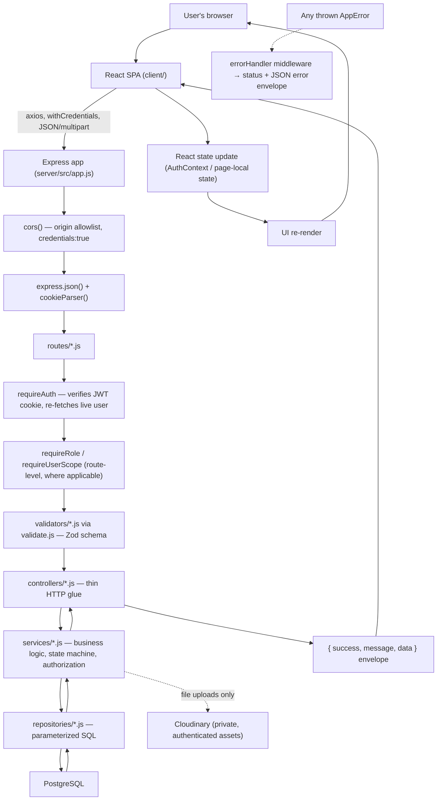

# Folder structure & architecture classification

> Part of the [Architecture & Workflow Reference](README.md). If this disagrees with the code, the code wins.

---

## Part 3 — Folder Structure & File Responsibility Map

```text
leave_management_system/
├── client/                        React (Vite) frontend
│   └── src/
│       ├── pages/                 One file per route's top-level page
│       ├── components/
│       │   ├── auth/              Login form, Google button, RoleGate
│       │   ├── routing/           RequireAuth, RequireRole, PublicOnlyRoute
│       │   ├── layout/            Sidebar, TopBar, AppLayout, NavBar
│       │   ├── ui/                Generic primitives (Button, Modal, Card, Badge, …)
│       │   ├── leave/             Leave-request/approval/delegation components
│       │   ├── team/              Employee invite/org-chart components
│       │   ├── calendar/          Holiday calendar components
│       │   └── dashboard/         Dashboard summary tiles
│       ├── context/               AuthContext + AuthProvider
│       ├── hooks/                 useAuth, useActiveDelegation, useClickOutside, usePendingApprovalsCount
│       ├── services/               One file per backend resource — the only place `apiClient` is called from feature code
│       ├── utils/                 dates.js, validation.js, employeeGroups.js
│       ├── constants/             roles.js, badges.js, leaveBalanceAccents.js
│       └── tests/                 Shared test fixtures/setup
│
├── server/                        Node/Express backend
│   └── src/
│       ├── app.js, server.js      Express app wiring / process entrypoint
│       ├── routes/                 Express routers — endpoints only
│       ├── middlewares/            requireAuth, requireRole, requireUserScope, errorHandler, uploadMiddleware, validate
│       ├── controllers/            Thin HTTP glue — read req, call a service, send a response
│       ├── services/                Business logic only
│       ├── repositories/            Raw parameterized SQL only, one file per table (roughly)
│       ├── validators/             Zod schemas, one file per resource
│       ├── utils/                  appError, apiResponse, cookies, jwt, password, csv, fileType, dates, secureToken
│       ├── config/                 db.js (pg Pool), googleClient.js, cloudinary.js
│       ├── sql/                    001…018, numbered sequential migrations, never edited after being applied
│       ├── scripts/runMigrations.js  Applies every file in sql/ in filename order
│       └── tests/
│           ├── unit/                No DB (workingDayService.test.js)
│           └── integration/         Real `_test` Postgres DB via Supertest, `setup.js` truncates all tables before each test
│
└── docs/                          1.functional_requirements.md, 2.api_documentation.md, 3.db.md,
                                    4.non_functional_requirements.md, architecture.md (this file)
```

**Backend architecture**, confirmed literally in `.claude/rules.md` and verified against every route/controller/service/repository read during this analysis:

```text
Client → Routes → Validator → Controller → Service → Repository → PostgreSQL
```

No layer is ever skipped for any endpoint built after the "no validators folder" gap was flagged — every new/changed endpoint has a matching Zod validator.

### File Responsibility Map (representative — the full set follows the identical pattern per resource)

| File | Responsibility | Called by | Calls |
|---|---|---|---|
| `server/src/routes/leaveRequestRoutes.js` | Declares every `/api/leave-requests/*` endpoint, wires middleware/validator/controller per route | Express app (`app.js`) | `authMiddleware`, `requireRole`, `validate.js`, `leaveRequestController.js` |
| `server/src/validators/leaveRequestValidator.js` | Zod schemas for preview/submit/decision/override/filter/report bodies+params+query | `leaveRequestRoutes.js` via `validate.js` | zod only |
| `server/src/controllers/leaveRequestController.js` | Reads `req.user`/`req.params`/`req.body`/`req.query`/`req.file`, calls one service function, sends the response | `leaveRequestRoutes.js` | `leaveRequestService.js`, `utils/apiResponse.js`, `utils/csv.js` |
| `server/src/services/leaveRequestService.js` | All leave-request business logic: submission validation order, `resolveActingCapacity` (authorization), ledger deltas, calls the state machine | `leaveRequestController.js` | `leaveRequestRepository.js`, `leaveBalanceLedgerRepository.js`, `auditLogRepository.js`, `leaveRequestDocumentRepository.js`, `cloudinaryService.js`, `workingDayService.js`, `leaveRequestStateMachine.js`, `reportingService.js` (`isUserInSubtree`), `delegationRepository.js` (`findActiveDelegation`) |
| `server/src/repositories/leaveRequestRepository.js` | Every parameterized SQL query against `leave_requests` (+ its joins) | `leaveRequestService.js` | `pg` Pool (`config/db.js`) |
| `client/src/components/leave/RequestLeaveForm.jsx` | Submit-a-leave-request form, client-side pre-validation, live working-day preview | `client/src/pages/MyBalancesPage.jsx` (inside a `Modal`) | `client/src/services/leaveRequestService.js` |
| `client/src/services/leaveRequestService.js` | Every `axios` call to `/leave-requests/*`, unwraps the response envelope | Pages/components | `apiClient.js` |

This exact pattern (`*Routes.js` → `*Validator.js` → `*Controller.js` → `*Service.js` → `*Repository.js`) repeats for every resource: `auth`, `users`, `leaveType`, `leaveBalance`, `holiday`, `delegation`. `.claude/rules.md` mandates this naming and layering explicitly.

---

## Part 4 — Architecture Classification

**Classification: a layered (N-tier) REST API backend + a client-server SPA frontend.** Not MVC (no server-rendered views — the backend never returns HTML for app routes), not a modular monolith with feature folders (folders are organized by *layer* — `controllers/`, `services/`, `repositories/` — not by feature module), not microservices (one Express process, one Postgres database).

**Why this classification**: every request flows through the same fixed sequence of layers regardless of resource (`Routes → Validator → Controller → Service → Repository → PostgreSQL`), each layer has exactly one responsibility (rules.md's own "Layer Responsibilities" section states this literally: "Routes — endpoints only. Validators — validate requests only. Controllers — receive request, call service, return response. Services — business logic only. Repositories — database access only."), and no layer is ever bypassed. The frontend is a separate SPA that only talks to the backend over a documented HTTP API — the brief's "the frontend and backend must be genuinely separate" requirement, confirmed by there being no server-side rendering, no shared code importing across the `client`/`server` boundary, and a fully documented API (`docs/2.api_documentation.md`).



---
