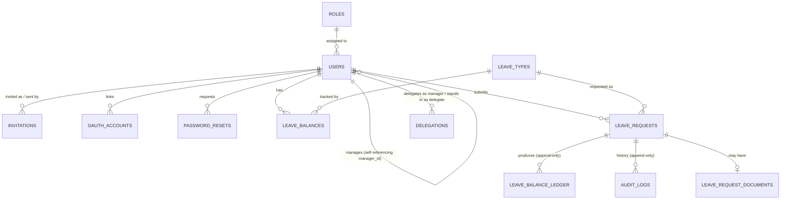

# Backend & database architecture

> Part of the [Architecture & Workflow Reference](README.md). If this disagrees with the code, the code wins.

---

## Part 6 — Backend Architecture

### `server.js` / `app.js`

- `server.js`: loads `.env`, reads `PORT` (default 5001), `app.listen(PORT, "0.0.0.0", ...)`. Registers `SIGTERM`/`SIGINT` handlers that close the HTTP server, then `pool.end()`, before exiting. **Does not** run migrations on boot — `npm run migrate` is a separate, manual step (see Part 3's folder tree and the Database section below).
- `app.js` middleware order:
  1. `app.set("trust proxy", 1)` (correct `secure` cookie behavior behind Render's proxy)
  2. `cors({ origin: allowedOrigins, credentials: true })` — `allowedOrigins` from `CLIENT_ORIGIN` env (comma-split), default `http://localhost:5173`
  3. `express.json()`
  4. `cookieParser()`
  5. `GET /health` (no auth, no DB) → `{ success:true, message:"ok", data:{ uptime } }`
  6. Route mounts: `/api/auth`, `/api/users`, `/api/leave-types`, `/api/leave-balances`, `/api/holidays`, `/api/leave-requests`, `/api/delegations`
  7. `notFoundHandler` (catch-all 404)
  8. `errorHandler` (centralized error → JSON)

### Middleware reference

| Function | File | What it checks / does | Attaches to `req` | Failure |
|---|---|---|---|---|
| `requireAuth` | `middlewares/authMiddleware.js` | Reads the cookie (`AUTH_COOKIE_NAME`, default `lms_token`), `jwt.verify`s it, **re-fetches the live user/role/status from the DB** (not trusted from the token payload) | `req.user = {id,email,status,role,manager_id}` | `unauthorized` (401) if missing/invalid/inactive |
| `requireRole(...roles)` | `middlewares/requireRole.js` | `req.user.role` ∈ list | — | `forbidden` (403) |
| `requireUserScope(paramName)` | `middlewares/requireUserScope.js` | Self, or HR_ADMIN, or a manager whose subtree includes `:id` (via `isUserInSubtree`) | — | `notFound` (404) if target missing, else `forbidden` (403) |
| `validateBody/Params/Query(schema)` | `validators/validate.js` | Zod `safeParse`, reassigns the parsed/coerced value back onto `req` | `req.body`/`params`/`query` | `422` with `{field,message}[]` |
| `uploadLeaveRequestDocument` | `middlewares/uploadMiddleware.js` | Multer, memory storage, 5MB limit, field name `document` | `req.file` | `MulterError` → 400 via `errorHandler` |
| `notFoundHandler` / `errorHandler` | `middlewares/errorHandler.js` | Maps any `AppError`→its status; Multer size limit→400; Postgres `23505` (unique violation)→409; `23503` (FK violation)→422; anything else→500 (logged) | — | — |

**Crucial design point**: `requireAuth` re-fetching the live user on every request (rather than trusting the JWT payload) is *why* deactivating a user or changing their role takes effect immediately, without waiting for token expiry — confirmed both in code and in `docs/2.api_documentation.md`'s note on `GET /api/auth/me`.

### Centralized authorization (NFR-1)

Two proven chokepoints, not scattered per-handler conditionals:

1. **`requireUserScope`** (`middlewares/requireUserScope.js`) — record-level scoping for the `users`/`leave-balances` domain.
2. **`resolveActingCapacity(actor, request, action)`** (`services/leaveRequestService.js`) — the single function every leave-request mutation (approve/reject/withdraw/cancel/override) calls to decide *whether* the actor may perform *this specific action* on *this specific row*. Full logic in Part 9 and Part 13.

### Centralized state machine (NFR-3)

`services/leaveRequestStateMachine.js` — one `TRANSITIONS` map, the *only* place status transitions are legal or not:

```js
const TRANSITIONS = {
    APPROVE:                 { from: ["SUBMITTED"], to: "APPROVED"   },
    REJECT:                  { from: ["SUBMITTED"], to: "REJECTED"   },
    WITHDRAW:                { from: ["SUBMITTED"], to: "WITHDRAWN"  },
    CANCEL:                  { from: ["APPROVED"],  to: "CANCELLED"  },
    HR_OVERRIDE_TO_APPROVED: { from: ["REJECTED"],  to: "APPROVED"   },
    HR_OVERRIDE_TO_REJECTED: { from: ["APPROVED"],  to: "REJECTED"   },
};
```

`assertLegalTransition(action, currentStatus)` throws `conflict()` (409) if the map has no matching `from`. `WITHDRAWN`/`CANCELLED` never appear as a `from` anywhere — confirmed dead ends.

### Backend request lifecycle example (concrete)

```text
POST /api/leave-requests/:id/approve
        ↓
Express router (leaveRequestRoutes.js) — no route-level role check for this action
        ↓
requireAuth — verifies cookie, loads live req.user
        ↓
validateParams(leaveRequestIdParamSchema) + validateBody(decisionSchema)
        ↓
leaveRequestController.approve = makeDecisionHandler("APPROVE")
        ↓
leaveRequestService.decideLeaveRequest(req.user, id, "APPROVE", comment)
        ↓
findLeaveRequestById(id) → 404 if missing
        ↓
resolveActingCapacity(actor, request, "APPROVE") → 403/404 if not allowed
        ↓
assertLegalTransition("APPROVE", request.status) → 409 if illegal
        ↓
updateLeaveRequestStatus(...) + insertLedgerEntry(...) + insertAuditLog(...)
        ↓
findLeaveRequestById(id) again (fresh joined row)
        ↓
Controller: sendSuccess(res, 200, "Leave request updated", request)
        ↓
HTTP 200 { success:true, message, data: <request> }
```

---

## Part 7 — Database Architecture

Full column-level breakdown lives in [`docs/3.db.md`](3.db.md) — this section is the condensed relationship/rationale view.



`HOLIDAYS` is standalone reference data — no FK to anything.

**Why each relationship exists**:
- `USERS ||--o{ USERS` (self-referencing `manager_id`) — models the reporting tree as one table instead of a separate hierarchy table; a recursive CTE (`isUserInSubtree`/`findSubtreeUsers`) walks it. `chk_manager_not_self` prevents the trivial 1-node cycle at the DB level; multi-node cycles are prevented in application code (`reportingService.assertNoCycle`) since Postgres has no native "no cycles" constraint.
- `LEAVE_REQUESTS ||--o{ LEAVE_BALANCE_LEDGER` — every state change writes one append-only ledger row instead of mutating a stored balance total; this is the structural implementation of "a balance must never drift" (NFR-2) — the balance *is* `SUM()` over this table at read time, so there is no separate number that could ever fall out of sync with the history that produced it.
- `LEAVE_REQUESTS ||--o{ AUDIT_LOGS` — a full, append-only trail (`auditLogRepository.js` exposes only an insert function; no update/delete exists anywhere for this table).
- `USERS ||--o{ DELEGATIONS` (twice — once as `manager_id`, once as `delegate_id`) — a manager nominates any other active user (not restricted to another manager) as their delegate for a date range.

**Design conventions used throughout** (from `docs/3.db.md`): every PK is `UUID DEFAULT gen_random_uuid()`; every table has `created_at`, most have `updated_at`; "soft" uniqueness (e.g. "one pending invite per user") uses a **partial unique index** rather than an app-only check, so it's DB-enforced even under concurrent requests; case-insensitive uniqueness (email, leave type name) uses a unique index on `lower(column)`; enums are `VARCHAR + CHECK IN (...)` rather than Postgres `ENUM`, so adding a value is a plain migration, not `ALTER TYPE`.

**Migrations**: 18 sequential numbered files in `server/src/sql/`, applied by `runMigrations.js` in filename order. **No migration-tracking table exists** — the runner just re-applies every file. This means: (a) new migrations must be idempotent-safe or applied by hand for the specific new file only, and (b) migrations must be applied *manually* to every environment (dev, `_test`, Render production) — there's no automatic sync, and a deployed frontend hitting an unmigrated production DB shows up as a generic load failure, easy to misdiagnose as an API/CORS bug (documented incident in `.claude/rules.md`).

---
