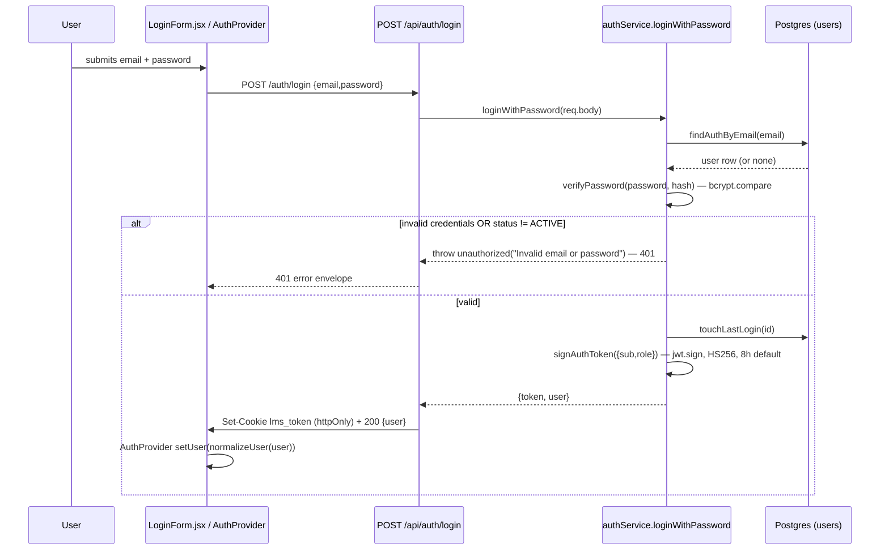
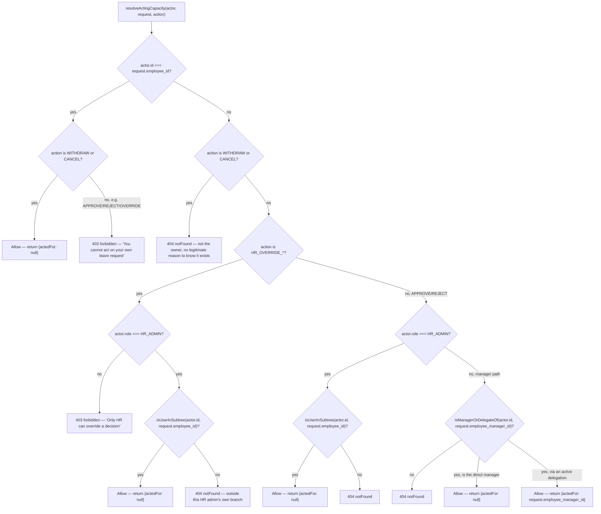

# Authentication & authorization flow

> Part of the [Architecture & Workflow Reference](README.md). If this disagrees with the code, the code wins.

---

## Part 8 — Authentication Flow

Three independent login paths all converge on the same outcome: an `httpOnly` cookie containing a signed JWT (`{sub, role}` for the first two flows; the invite-accept flow signs `{sub}` only), and a `{success,message,data:{user}}` response.

### Password login



**Deliberate ambiguity**: unknown email, wrong password, and a non-`ACTIVE` account all collapse to the exact same 401 message — this is intentional (no user enumeration).

### Google OAuth

1. `GoogleLoginButton.jsx` renders `@react-oauth/google`'s widget; on success it hands back `credentialResponse.credential` — a Google-signed ID token (JWT), no server round-trip needed to get it.
2. `POST /api/auth/google { idToken }` → `authService.loginWithGoogle(idToken)`.
3. `getGoogleClient().verifyIdToken({idToken, audience: GOOGLE_CLIENT_ID})` — verifies the signature *and* the audience claim. Any failure → `unauthorized` (401).
4. `!payload.email_verified` → `unauthorized` (401) — still a "credential quality" problem, not an authorization one.
5. `findAuthByEmail(payload.email)` — **must already exist and be `ACTIVE`**, else `forbidden("No account found for this email")` (403). Google is never used to create an account.
6. First-time sign-in: `insertOauthAccount` links `oauth_accounts` (provider=`GOOGLE`, subject=`payload.sub`). Subsequent sign-ins skip the insert (link already found via `findByProviderSubject`).
7. Same cookie/response mechanics as password login.

> **GitHub OAuth was added and then removed by direct request** — it briefly existed as a second provider (authorization-code flow, `GithubLoginButton.jsx`/`GithubCallbackPage.jsx`/`config/githubClient.js`/`POST /api/auth/github`), following the identical business rule as Google (login-only, never signup). It was fully reverted: the code was deleted, `oauth_accounts.provider`'s CHECK constraint was narrowed back to `'GOOGLE'` only (migration `019`, after migration `018` had briefly widened it), and every reference to it was removed from this document. Google remains the only OAuth provider.

### 401 vs 403 — the exact rule across both paths

| Condition | Status | Why |
|---|---|---|
| Wrong password / unknown email / inactive account (password login) | 401 | Credential itself doesn't check out; deliberately not distinguished (no enumeration) |
| Invalid/unverifiable Google ID token, or unverified Google email | 401 | Credential-quality problem |
| Google identity is provably genuine, but **no matching active account** | **403** | Identity is proven; there's simply no permission for it — the codebase's literal implementation of "OAuth is login-only, never signup" |

### Logout / session end

`POST /api/auth/logout` clears the cookie (`clearAuthCookie`, same options as `setAuthCookie` so the browser actually matches and removes it) and always returns 200 — there's no server-side token to invalidate since auth is stateless JWT-in-cookie. A deactivated/role-changed user's *next* request fails at `requireAuth` (live re-fetch), effectively ending their session without needing any token blacklist.

---

## Part 9 — Authorization / Role Flow

**Why authorization must be enforced on the backend, not just the UI**: the brief's own framing, echoed throughout `.claude/rules.md` — a reviewer is expected to open the network tab, change an id in a request, and try to act on somebody else's record. Every "hide this button for this role" decision in the frontend (`canOverride`, `RoleGate`, `RequireRole`) is a UX nicety only; the actual gate is server-side and produces the exact same 403/404 whether or not the UI would have shown the control.

**Three roles**, additive, not mutually exclusive privilege tiers: `EMPLOYEE` (base), `MANAGER` (adds team visibility/approval), `HR_ADMIN` (adds company-subtree visibility + admin actions).

### `resolveActingCapacity(actor, request, action)` — the full decision tree

(`server/src/services/leaveRequestService.js`, the single chokepoint for every leave-request mutation)



`isManagerOrDelegateOf(actorId, employeeManagerId)`: `true` immediately if `employeeManagerId === actorId` (direct manager); otherwise queries `findActiveDelegation({managerId: employeeManagerId, delegateId: actorId, onDate: todayDateKey()})` — a live, per-call date-range check against the `delegations` table, never cached or assumed.

**403 vs 404 policy (NFR-5), applied deliberately**: if the caller has no legitimate reason to know the request exists at all (unrelated manager, unrelated employee, an HR admin outside their own branch, or a delegate whose window has lapsed) → **404**. If the caller already knows the request exists because it's their own, but this specific action isn't theirs to take (e.g. approving your own request) → **403**. A documented simplification: "a delegate whose window has expired" is treated identically to "never was a delegate" — both 404, not a 403 for the expired case, since distinguishing them needs an extra query for no real security benefit.

### Reporting-tree scoping — the second authorization mechanism

`requireUserScope(paramName)` (middleware) gates `GET /users/:id` and `GET /leave-balances/user/:id`: self, or `HR_ADMIN`, or a `MANAGER` whose subtree includes the target (`isUserInSubtree`).

`changeManager`/`changeStatus` (`userService.js`) add a *third*, narrower rule on top: even an `HR_ADMIN` who can *see* every user can only *edit* the manager/status of a user they themselves created (`actor.id === target.invited_by`) — a real bug found and fixed mid-project (see `.claude/rules.md`'s bullet on this), generalized from "HR_ADMIN targets only" to every role.

### Concrete example: employee attempts an HR-only endpoint

```text
EMPLOYEE calls POST /api/leave-types (create a leave type)
        ↓
requireAuth — passes (they're logged in)
        ↓
requireRole("HR_ADMIN") — req.user.role is "EMPLOYEE", not in the allowed list
        ↓
403 Forbidden — {success:false, message:"You do not have permission to perform this action", errors:[]}
```

---
