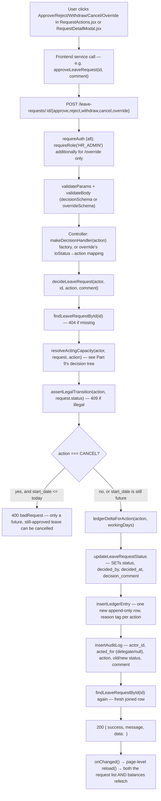

# Workflow — approve / reject / override / withdraw / cancel

> Part of the [Architecture & Workflow Reference](README.md). If this disagrees with the code, the code wins.

---

## Part 13 — Leave Approval / Rejection / Override / Withdraw / Cancel Workflow

All five decision actions share one code path — `decideLeaveRequest(actor, requestId, action, comment)` in `services/leaveRequestService.js` — differing only in the `action` string and two small per-action lookup tables. This is the single most important piece of business logic in the codebase to be able to explain fluently.



### The two lookup tables that differentiate every action

```js
// server/src/services/leaveRequestService.js
function ledgerDeltaForAction(action, workingDays) {
    switch (action) {
        case "APPROVE":                 return { pendingDelta: -workingDays, takenDelta: workingDays };
        case "REJECT":
        case "WITHDRAW":                return { pendingDelta: -workingDays, takenDelta: 0 };
        case "CANCEL":                  return { pendingDelta: 0,            takenDelta: -workingDays };
        case "HR_OVERRIDE_TO_APPROVED": return { pendingDelta: 0,            takenDelta: workingDays };
        case "HR_OVERRIDE_TO_REJECTED": return { pendingDelta: 0,            takenDelta: -workingDays };
    }
}
// Ledger "reason" tag per action:
// APPROVE→"APPROVE", REJECT→"REJECT", WITHDRAW→"WITHDRAW", CANCEL→"CANCEL",
// HR_OVERRIDE_TO_APPROVED→"HR_OVERRIDE_APPROVE", HR_OVERRIDE_TO_REJECTED→"HR_OVERRIDE_REJECT"
```

### Comparison table — every decision action

| Action | State transition | Who can act (`resolveActingCapacity`) | `pending_delta` | `taken_delta` | Audit `action` value |
|---|---|---|---|---|---|
| Approve | SUBMITTED → APPROVED | direct manager, active delegate, or HR (own subtree) | `-workingDays` | `+workingDays` | `APPROVE` |
| Reject | SUBMITTED → REJECTED | same as Approve | `-workingDays` | `0` | `REJECT` |
| Withdraw | SUBMITTED → WITHDRAWN | **owner only** (404 for anyone else, before any role check) | `-workingDays` | `0` | `WITHDRAW` |
| Cancel | APPROVED → CANCELLED | **owner only**, plus a server-side "start date still in the future" guard | `0` | `-workingDays` | `CANCEL` |
| HR override → approved | REJECTED → APPROVED | HR_ADMIN, own subtree only (dedicated branch, no delegate concept) | `0` | `+workingDays` | `HR_OVERRIDE_TO_APPROVED` |
| HR override → rejected | APPROVED → REJECTED | HR_ADMIN, own subtree only | `0` | `-workingDays` | `HR_OVERRIDE_TO_REJECTED` |

**Why approve/reject share one branch but withdraw/cancel are separate**: the owner-only check for withdraw/cancel runs *before* any role/manager/HR/delegate logic is even reached — an employee's own actions on their own request never touch the manager/HR authorization branch at all. Approve/reject/override, by contrast, explicitly forbid the owner (an employee can never approve their own request, checked first) and then branch by role.

**Why overrides only touch `taken_delta`, never `pending_delta`**: by the time an override happens, the original approve/reject already resolved the pending hold one way or the other — overriding is purely "flip what actually happened," not "re-open a pending decision." The ledger is append-only, so the override posts a *new* row on top of the original decision's row rather than editing it; the balance query's `SUM()` nets them out automatically.

### Delegate sub-trace — the exact mechanics of "acting on someone's behalf"

1. `isManagerOrDelegateOf(actorId, employeeManagerId)`: `true` immediately if `employeeManagerId === actorId`; otherwise queries `findActiveDelegation({managerId: employeeManagerId, delegateId: actorId, onDate: todayDateKey()})`.
2. Repository SQL (`delegationRepository.js`):
   ```sql
   SELECT id FROM delegations
   WHERE manager_id = $1 AND delegate_id = $2 AND start_date <= $3 AND end_date >= $3
   LIMIT 1
   ```
3. If found, `resolveActingCapacity` computes `actingAsDelegate = request.employee_manager_id !== actor.id` (true, since the delegate isn't literally the manager) and returns `{ actedFor: request.employee_manager_id }`.
4. `decideLeaveRequest` passes that straight into `insertAuditLog({..., actorId: actor.id, actedFor})` — `actor_id` is who physically clicked the button, `acted_for` is the manager they represented. The leave request's own `decided_by` column is *also* the delegate's id (not the manager's) — the manager attribution lives only in the audit trail.
5. `RequestDetailModal.jsx`'s `actorName()` helper renders this as "X (on behalf of Y)" in the history view whenever `acted_for` is set.

**Delegate discovery**: `GET /api/delegations/as-delegate` is deliberately **not** role-gated (a plain `EMPLOYEE` can be nominated as a delegate) — `useActiveDelegation.js` polls this on mount, filters to delegations whose date range covers today, and both `NavBar` (reveals the Approvals nav link to a non-manager) and the `DelegateStatus` dashboard tile key off it. `RequireRole`'s `alsoAllowIfActiveDelegate` prop lets `/dashboard/approvals` admit a currently-delegating employee even though the route is otherwise `MANAGER`/`HR_ADMIN`-only.

**Team-list merging**: `listTeamLeaveRequests(actor)` for a non-HR actor merges the actor's own `findDirectReports(actor.id)` with `findDirectReports(managerId)` for every manager the actor is *currently* delegating for (`findActiveDelegatedManagerIds`) — so a delegate sees the delegated-for team's requests in the same list as their own, labeled "Delegated for X" in `TeamRequestList.jsx` when `employee_manager_id` differs from the viewer.

### Interview-ready answer

> "Every leave-request decision — approve, reject, withdraw, cancel, HR override — funnels through one function, `decideLeaveRequest`, so there's exactly one place that does the state transition and the balance math, not five copies of similar logic. It first re-fetches the request, then calls `resolveActingCapacity`, which is the single authorization chokepoint: it checks ownership first — an employee can withdraw or cancel their own request but can never approve it — then branches by role: HR only if the employee is in that specific HR admin's own reporting subtree, since we support more than one HR admin, each rooted at a different branch; otherwise it checks if the actor is the direct manager or has an active, date-bounded delegation for that manager. Then it runs the action past a single state-transition map — that's the one place you can see every legal move, so approving an already-cancelled request just isn't representable, it 409s. Then it computes a ledger delta from a small lookup table — approve moves days from pending to taken, reject and withdraw just release the pending hold, cancel returns taken days, and the two override actions flip taken directly since pending was already resolved by the original decision. That ledger entry is append-only, which is also how the balance never drifts — the number you see is always a live `SUM()` over that ledger, never a stored total anyone could accidentally leave stale."

---
